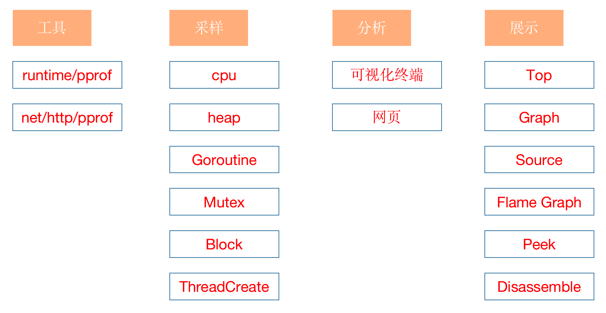
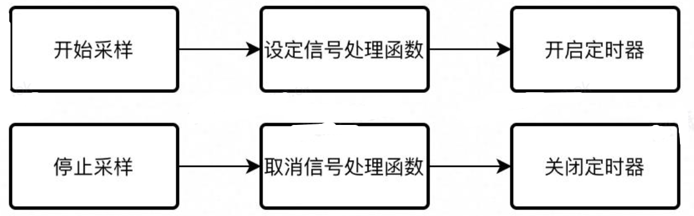
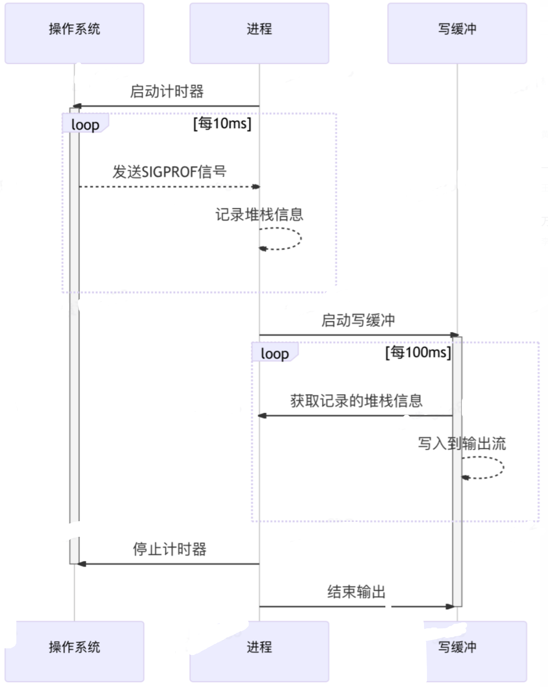
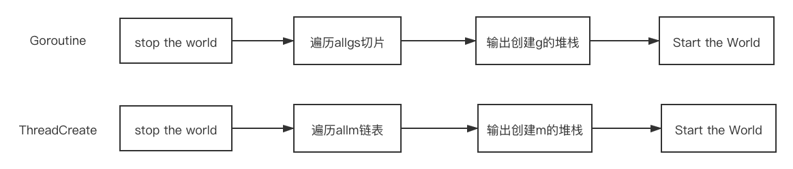
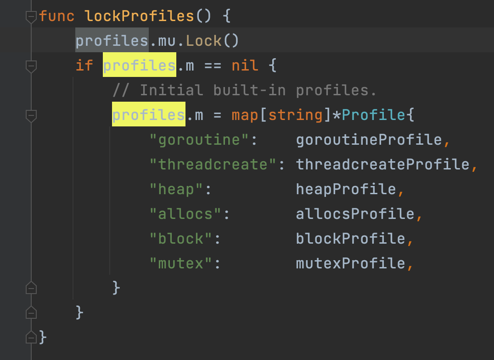
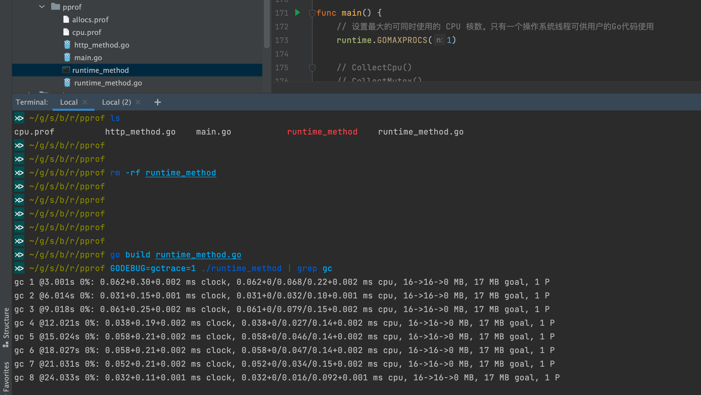
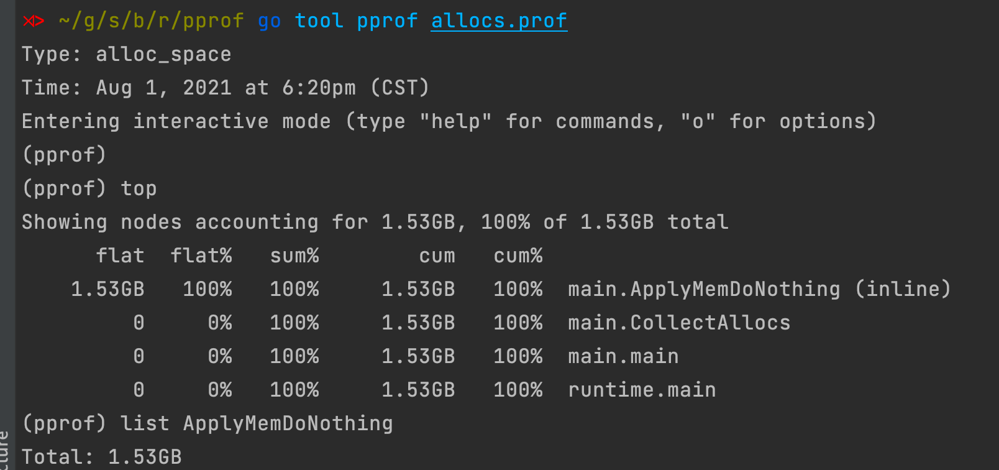
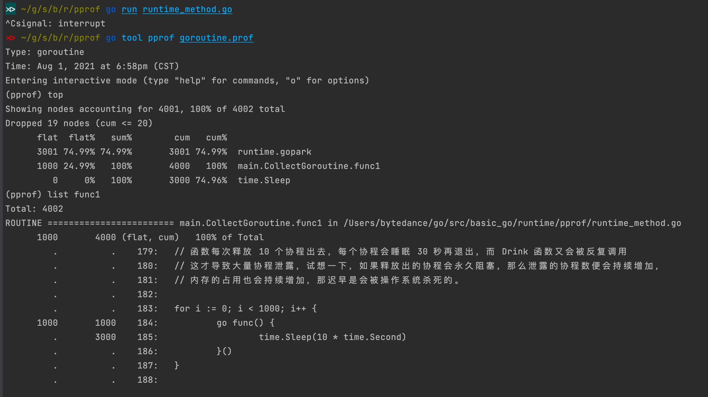
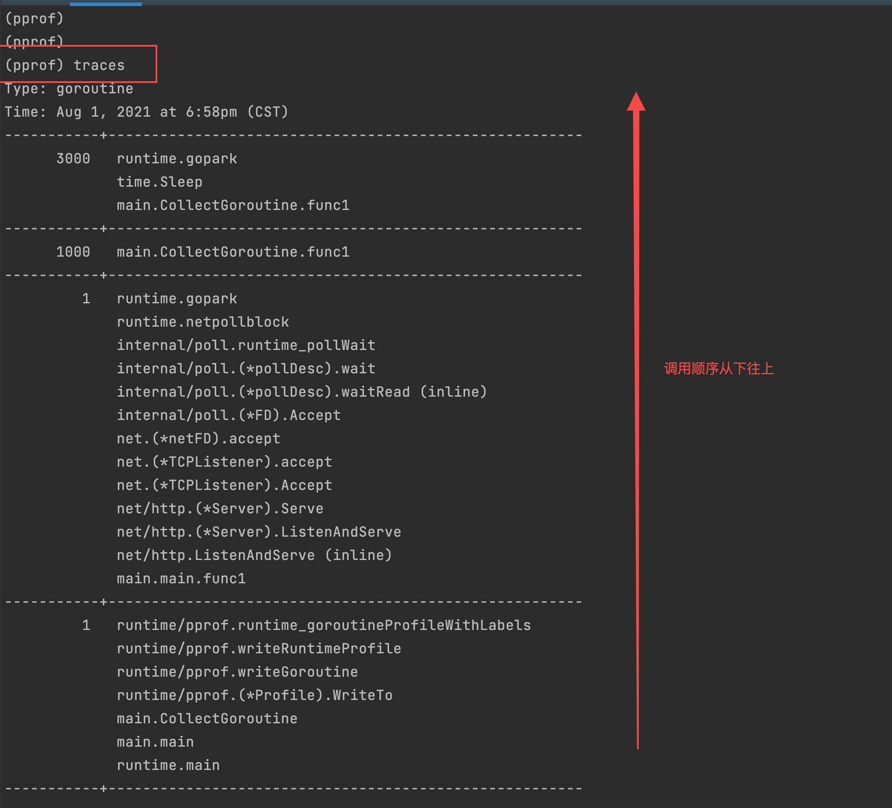
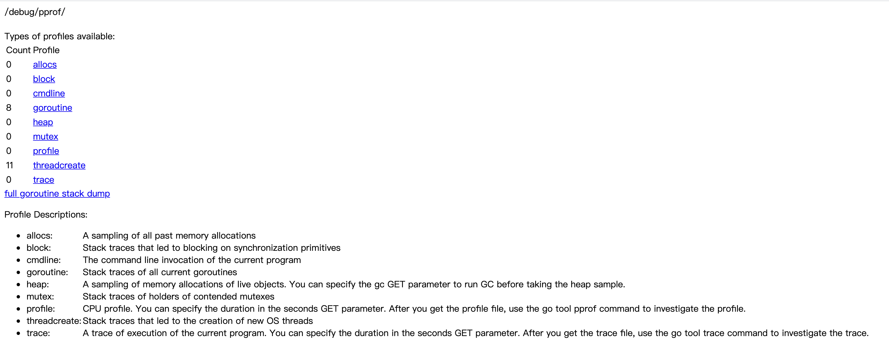

# 性能测试-pprof-overview
> 参考文章：https://geektutu.com/post/hpg-pprof.html
> https://zhuanlan.zhihu.com/p/51559344
> http://www.zyiz.net/tech/detail-112761.html
> https://www.cnblogs.com/jiujuan/p/14588185.html
> https://blog.wolfogre.com/posts/go-ppof-practice/
> https://www.liwenzhou.com/posts/Go/performance_optimisation/#autoid-1-5-2
> https://blog.wolfogre.com/posts/go-ppof-practice/
> https://github.com/wolfogre/blog-utterances/issues/39
> https://golang2.eddycjy.com/posts/ch6/01-pprof-1/
> https://github.com/eddycjy/blog
> https://github.com/brendangregg/FlameGraph/blob/master/README.md
> [鸟窝]-[译] Go 可视化性能分析工具
> https://www.cnblogs.com/jiujuan/p/14604609.html

> https://debug-lixiwen.github.io/2021/07/18/shi-zhan/

## 1. 概述 
### 1.1 pprof 

> 一句话描述：Golang自带的一款开箱即用的性能监控和分析工具。
> 
在 Go 语言中，pprof 是用于可视化和分析性能分析数据的工具，pprof 以 profile.proto 读取分析样本的集合，并生成报告以可视化并帮助分析数据（支持文本和图形报告）。

而刚刚提到的 profile.proto 是一个 Protobuf v3 的描述文件，它描述了一组 callstack 和 symbolization 信息， 作用是统计分析的一组采样的调用栈，是很常见的 stacktrace 配置文件格式。

### 1.2 pprof 使用姿势
- **`runtime/pprof`**
  - 手动调用`runtime.StartCPUProfile/runtime.StopCPUProfile`等API来进行数据的采集。
  - 优点：灵活性高、按需采集。
  - 使用场景：工具型应用（比如说定制化的分析小工具、集成到公司监控系统）

- **`net/http/pprof`**
  - 通过http服务来获取Profile采样文件。 import _ "net/http/pprof"
  - 优点：简单易用。
  - 使用场景：在线服务（一直运行着的程序）
  - (net/http/pprof中只是使用runtime/pprof包来进行封装了一下，并在http端口上暴露出来)

- **`go test`**
  - 通过命令go test -bench . -cpuprofile cpu.prof来进行采集数据。
  - 优点：针对性强、细化到函数
  - 使用场景：进行某函数的性能测试

### 1.3 pprof 作用
go的pprof提供了2个工具供我们使用，runtime/pprof中是它的源码，net/http/pprof对源码做了简单封装，能让你在http服务中直接使用。

它可以采样程序运行时的CPU、堆内存、Goroutine、锁竞争、阻塞调用、系统线程的使用情况。然后通过可视化终端或网页的形式展示给用户，用户可以通过列表、调用图、源码、火焰图、反汇编等视图去展示采集到的性能指标



#### 1.3.1 pprof指标采样的维度
- CPU（profile）
  - **`CPU Profiling`**：CPU 分析，按照一定的频率采集所监听的应用程序 CPU（含寄存器）的使用情况，可确定应用程序在主动消耗 CPU 周期时花费时间的位置。
  - 报告CPU的使用情况，定位到热点（消耗CPU周期最多的）代码。默认情况下Go以100HZ的频率进行CPU采样
- Goroutine
  - **`Goroutine Profiling`**： Goroutine 分析，可以对当前应用程序正在运行的 Goroutine 进行堆栈跟踪和分析。这项功能在实际排查中会经常用到，因为很多问题出现时的表象就是 Goroutine 暴增，而这时候我们要做的事情之一就是查看应用程序中的 Goroutine 正在做什么事情，因为什么阻塞了，然后再进行下一步。
- 系统线程
  - 获取导致创建 OS 线程的 goroutine 堆栈
- 堆内存/内存剖析（heap）
  - **`Memory Profiling`**：内存分析，在应用程序进行堆分配时记录堆栈跟踪，用于监视当前和历史内存使用情况，以及检查内存泄漏。
  - 包含每个 goroutine 分配大小，分配堆栈等。
  - 每分配 runtime.MemProfileRate(默认为512K) 个字节进行一次数据采样。

- 内存剖析（allocs）：报告所有内存分配历史 
- 阻塞操作
  - **`Block Profiling`**：阻塞分析，记录 Goroutine 阻塞等待同步（包括定时器通道）的位置，默认不开启，需要调用 runtime.SetBlockProfileRate 进行设置。
  - 获取导致阻塞的 goroutine 堆栈(如 channel, mutex 等)，使用前需要先调用 runtime.SetBlockProfileRate
- 锁竞争
  - **`Mutex Profiling`**：互斥锁分析，报告互斥锁的竞争情况，默认不开启，需要调用 runtime.SetMutexProfileFraction 进行设置。
- 执行追踪（trace）：追踪当前应用程序的执行栈

## 2. 采样原理
### 2.1 CPU采样
CPU采样会记录所有的调用栈和它们的占用时间。

在采样时，进程会每秒暂停一百次，每次会记录当前的调用栈信息。

汇总之后，根据调用栈在采样中出现的次数来推断函数的运行时间。 你需要手动地启动和停止采样。每秒100次的暂停频率也不能更改。

这个定时暂停机制在unix或类unix系统上是依赖信号机制实现的。

每次「暂停」都会接收到一个信号，通过系统计时器来保证这个信号是固定频率发送的。 接下来看看具体的流程。

一共有三个相关角色：进程本身、操作系统和写缓冲。

启动采样时，进程向OS注册一个定时器，OS会每隔10ms向进程发送一个SIGPROF信号，进程接收到信号后就会对当前的调用栈进行记录。

与此同时，进程会启动一个写缓冲的goroutine，它会每隔100ms从进程中读取已经记录的堆栈信息，并写入到输出流。

当采样停止时，进程向OS取消定时器，不再接收信号，写缓冲读取不到新的堆栈时，结束输出。

采样对象：函数调用和它们的占用时间

采样率：100次/秒

固定值采样时间：从手动启动到手动结束

- 操作系统：每10ms向进程发送一次SIGPROF信号
- 进程：每次接收到SIGPROF会记录调用栈
- 写缓冲：每100ms读取一次已经记录的调用栈并写入输出流




### 2.2.2 Goroutine & ThreadCreate采样
接下来我们来看看goroutine和系统线程的采样。这两个采样指标在概念上和实现上都比较相似，所以在这里进行对比。

**Goroutine采样会记录所有用户发起，也就是入口不是runtime开头的goroutine，以及main函数所在goroutine的信息和创建这些goroutine的调用栈；**

**ThreadCreate采样会记录由程序创建的所有系统线程的信息和调用栈**。

他们在实现上非常的相似，都是会在STW之后，遍历所有goroutine/所有线程的列表（图中的m就是GMP模型中的m，在golang中和线程一一对应），并输出堆栈，最后Start The World继续运行。

这个采样是立刻触发的全量记录，你可以通过比较两个时间点的差值来得到某一时间段的指标。

Goroutine：记录所有用户发起且在运行中的goroutine（即入口非runtime开头的）和runtime.main的调用栈信息

ThreadCreate：记录程序创建的所有系统线程的信息


### 2.2.3 Heap（堆内存）采样
接下来看看堆内存采样。 我在提到内存指标的时候说的都是「堆内存」而不是「内存」，这是因为pprof的内存采样是有局限性的。

内存采样在实现上依赖了内存分配器的记录，所以它只能记录在堆上分配，且会参与GC的内存，一些其他的内存分配，例如调用结束就会回收的栈内存、一些更底层使用cgo调用分配的内存，是不会被内存采样记录的。

它的采样率是一个大小，默认每分配512KB内存会采样一次，采样率是可以在运行开头调整的，设为1则为每次分配都会记录。

与CPU和goroutine都不同的是，内存的采样是一个持续的过程，它会记录从程序运行起的所有分配或释放的内存大小和对象数量，并在采样时遍历这些结果进行汇总。

还记得刚才的例子中，堆内存采样的四种指标吗？alloc的两项指标是从程序运行开始的累计指标，而inuse的两项指标是通过累计分配减去累计释放得到的程序当前持有的指标。

你也可以通过比较两次alloc的差值来得到某一段时间程序分配的内存【大小和数量】

采样程序通过内存分配器在堆上分配和释放的内存，记录分配/释放的大小和数量

采样率：每分配512KB记录一次，可在运行开头修改，1为每次分配均记录

采样时间：从程序运行开始到采样时

采样指标：alloc_space, alloc_objects, inuse_space, inuse_objects

计算方式：inuse=alloc-free

### 2.2.4 Block(阻塞) & Mutex(锁竞争)采样
讲完了堆内存，还剩下阻塞和锁竞争这两种采样。 这两个指标在流程和原理上也非常相似，我在这里也做了一个对比。

这两个采样记录的都是对应操作发生的调用栈、次数和耗时，不过这两个指标的采样率含义并不相同。

阻塞操作的采样率是一个「阈值」，消耗超过阈值时间的阻塞操作才会被记录，1为每次操作都会记录。

锁竞争的采样率是一个「比例」，运行时会通过随机数来只记录固定比例的锁操作，1为每次操作都会记录。

它们在实现上也是基本相同的。都是一个「主动上报」的过程。

在阻塞操作或锁操作发生时，会计算出消耗的时间，连同调用栈一起主动上报给采样器，采样器会根据采样率可能会丢弃一些记录。

在采样时，采样器会遍历已经记录的信息，统计出具体操作的次数、调用栈和总耗时。和堆内存一样，你可以对比两个时间点的差值计算出段时间内的操作指标。

阻塞操作

采样阻塞操作的次数和耗时

采样率：阻塞耗时超过阈值的才会被记录，1为每次阻塞均记录

锁竞争

采样争抢锁的次数和耗时

采样率：只记录固定比例的锁操作，1为每次加锁均记录


## 3 pprof 使用模式
**` Report generation`**：报告生成
**`Interactive terminal use`**：交互式终端
**`Web interface`**：Web 界面


## 4. 采样方式
| 方式名称       | 如何使用                                                                                                                                                                                                    | 优点                 | 缺点 | 使用场景                                                                                 |
| -------------- | ----------------------------------------------------------------------------------------------------------------------------------------------------------------------------------------------------------- | -------------------- | ---- | ---------------------------------------------------------------------------------------- |
| runtime/pprof  | 手动调用【runtime.StartCPUProfile、runtime.StopCPUProfile】等API来进行数据的采集。采集程序（非 Server）的指定区块的运行数据进行分析。                                                                       | 灵活性高、按需采集。 |      | 工具型应用（比如说定制化的分析小工具、集成到公司监控系统）。这种应用运行一段时间就结束。 |
| net/http/pprof | 通过http服务来获取Profile采样文件。 `import _ "net/http/pprof"`。基于 HTTP Server 运行，并且可以采集运行时数据进行分析。`net/http/pprof`中只是使用`runtime/pprof`包来进行封装了一下，并在http端口上暴露出来 | 简单易用             |      | 在线服务（一直运行着的程序）                                                             |
| go test        | 通过命令`go test -bench . -cpuprofile cpu.prof`来进行采集数据。                                                                                                                                             | 针对性强、细化到函数 |      | 进行某函数的性能测试                                                                     |

上面的 pprof 开启后，每隔一段时间就会采集当前程序的堆栈信息，获取函数的 cpu、内存等使用情况。通过对采样的数据进行分析，形成一个数据分析报告。

pprof 以 [profile.proto](https://github.com/google/pprof/blob/master/proto/profile.proto) 的格式保存数据，然后根据这个数据可以生成可视化的分析报告，支持文本形式和图形形式报告。
profile.proto 里具体的数据格式是 [protocol buffers](https://developers.google.com/protocol-buffers)。

那用什么方法来对数据进行分析，从而形成文本或图形报告？

用一个命令行工具 `go tool pprof `。

### 4.1 go test
- **cpu 使用分析：-cpuprofile=cpu.pprof**
- **内存使用分析：-benchmem -memprofile=mem.pprof**
- **block分析：-blockprofile=block.pprof**

运行命令采样数据：
```bash
sh

go test -bench=. -run=none -benchmem -memprofile=mem.pprof

go test -bench=. -run=none -blockprofile=block.pprof

go test -bench=. -run=none -benchmem -memprofile=mem.pprof -cpuprofile=cpu.pprof

go test -bench=. -run=none -benchmem -memprofile=mem.pprof -cpuprofile=cpu.pprof -blockprofile=block.pprof
```

### 4.2 5.2 runtime/pprof
除了注入 http handler 和 go test 以外，我们还可以在程序中通过 pprof 所提供的 Lookup 方法来进行相关内容的采集和调用，其一共支持六种类型，分别是：goroutine、threadcreate、heap、block、mutex，代码如下：

除了注入 http handler 和 go test 以外，我们还可以在程序中通过 pprof 所提供的 Lookup 方法来进行相关内容的采集和调用，其一共支持六种类型，分别是：goroutine、threadcreate、heap、block、mutex，代码如下：
```golang
type LookupType int8

const (
	LookupGoroutine LookupType = iota
	LookupThreadcreate
	LookupHeap
	LookupAllocs
	LookupBlock
	LookupMutex
)

func pprofLookup(lookupType LookupType, w io.Writer) error {
	var err error
	switch lookupType {
	case LookupGoroutine:
		p := pprof.Lookup("goroutine")
		err = p.WriteTo(w, 2)
	case LookupThreadcreate:
		p := pprof.Lookup("threadcreate")
		err = p.WriteTo(w, 2)
	case LookupHeap:
		p := pprof.Lookup("heap")
		err = p.WriteTo(w, 2)
	case LookupAllocs:
		p := pprof.Lookup("allocs")
		err = p.WriteTo(w, 2)
	case LookupBlock:
		p := pprof.Lookup("block")
		err = p.WriteTo(w, 2)
	case LookupMutex:
		p := pprof.Lookup("mutex")
		err = p.WriteTo(w, 2)
	}
	return err
}
```
接下来我们只需要对该方法进行调用就好了，其提供了 io.Writer 接口，也就是只要实现了对应的 Write 方法，我们可以将其写到任何支持地方去，如下：
```golang
... 
func init() {
	runtime.SetMutexProfileFraction(1)
	runtime.SetBlockProfileRate(1)
}
func main() {
	http.HandleFunc("/lookup/heap", func(w http.ResponseWriter, r *http.Request) { _ = pprofLookup(LookupHeap, os.Stdout) })
	http.HandleFunc("/lookup/threadcreate", func(w http.ResponseWriter, r *http.Request) { _ = pprofLookup(LookupThreadcreate, os.Stdout) })
	http.HandleFunc("/lookup/block", func(w http.ResponseWriter, r *http.Request) { _ = pprofLookup(LookupBlock, os.Stdout) })
	http.HandleFunc("/lookup/goroutine", func(w http.ResponseWriter, r *http.Request) { _ = pprofLookup(LookupGoroutine, os.Stdout) })
	_ = http.ListenAndServe("0.0.0.0:6060", nil)
}
```
在上述代码中，我们将采集结果写入到了控制台上，我们可以进行一下验证，调用 `http://127.0.0.1:6060/lookup/heap`，控制台输出结果如下：
```bash
$ go run main.go
heap profile: 0: 0 [0: 0] @ heap/1048576

# runtime.MemStats
# Alloc = 180632
# TotalAlloc = 180632
# Sys = 69928960
# Lookups = 0
...
```
本章节所有测试都是使用的`runtime_method.go`文件，子章节只会展示我的测试代码，统一用一个入口main函数。

mian函数如下
```golang
package main

import (
    "fmt"
    "log"
    "os"
    "runtime"
    "runtime/pprof"
    "sync"
    "time"
)
func main() {
    // 设置最大的可同时使用的 CPU 核数。只有一个操作系统线程可供用户的Go代码使用
    runtime.GOMAXPROCS(1)

    CollectCpu()
    // CollectMutex()
    // CollectBlock()
    // CollectHeap()
    // CollectAllocs()
}
```
运行函数方法：执行命令,`runtime_method.go`是我的文件名
```bash
go run runtime_method.go
```
结果分析方式也是一样的，如下。
```
go tool pprof cpu.prof
```
执行命令行两件套
```
top
list 函数名

生成web页面查看
web
```
或者通过暴露http端口的方式，可以查看更多类型的图。
```shell
go tool pprof -http=:6060 cpu.prof
```


### 4.2.1 采集CPU(CPU 占用过高)
```GOLANG
func CollectCpu() { 

    // 创建分析文件，在当前目录下
    file, err := os.Create("./cpu.prof")
    if err != nil {
        fmt.Printf("创建采集文件失败, err:%v\n", err)
        return
    }
    // 进行cpu数据的获取
    pprof.StartCPUProfile(file)
    defer pprof.StopCPUProfile()

    // 执行一段有问题的代码
    for i := 0; i < 4; i++ {
        go do1()
    }
    time.Sleep(10 * time.Second)
}
```
### 4.2.2 采集内存(heap-内存占用过高)
```GO
const (
    Ki = 1024
    Mi = Ki * Ki
    Gi = Ki * Mi
    Ti = Ki * Gi
    Pi = Ki * Ti
)
type Mouse struct {
    buffer [][Mi]byte
}

func (m *Mouse)StealMem() {
    max := Gi
    for len(m.buffer) * Mi < max {
        m.buffer = append(m.buffer, [Mi]byte{})
    }
}
func CollectHeap()  {
    // 设置采样率，默认每分配512*1024字节采样一次。如果设置为0则禁止采样，只能设置一次
    runtime.MemProfileRate = 512 * 1024
    f, err := os.Create("./heap.prof")
    if err != nil {
        log.Fatal("could not create heap profile: ", err)
    }
    defer f.Close()
    // 高的内存占用 : 有个循环会一直向 m.buffer 里追加长度为 1 MiB 的数组，直到总容量到达 1 GiB 为止，且一直不释放这些内存，这就难怪会有这么高的内存占用了。
    m := &Mouse{}
    m.StealMem()
    // runtime.GC() // 执行GC，避免垃圾对象干扰

    // 将剖析概要信息记录到文件
    if err := pprof.WriteHeapProfile(f); err != nil {
        log.Fatal("could not write heap profile: ", err)
    }
}
```
### 4.2.3 采集内存(allocs-频繁内存回收)
获取程序运行依赖，所有内存分配的历史
```golang
func ApplyMemDoNothing() {
	// 在 golang 里，对象是使用堆内存还是栈内存，由编译器进行逃逸分析并决定，如果对象不会逃逸，便可在使用栈内存，
	// 但总有意外，就是对象的尺寸过大时，便不得不使用堆内存。所以这里设置申请 16 MiB 的内存就是为了避免编译器直接在栈上分配，如果那样得话就不会涉及到 GC 了。
	_ = make([]byte, 16*Mi)
}
func CollectAllocs() {
	// 设置采样率，默认每分配512*1024字节采样一次。如果设置为0则禁止采样，只能设置一次 runtime.
	runtime.MemProfileRate = 512 * 1024

	f, err := os.Create("./allocs.prof")
	if err != nil {
		log.Fatal("could not create memory profile: ", err)
	}
	defer f.Close()
	// 频繁内存回收
	for i := 0; i < 100; i++ {
		time.Sleep(3 * time.Second)
		ApplyMemDoNothing()
	}
	// runtime.GC() // 执行GC，避免垃圾对象干扰

	// 将剖析概要信息记录到文件
	if err := pprof.Lookup("allocs").WriteTo(f, 0); err != nil {
		log.Fatal("could not write allocs profile: ", err)
	}
}
```
为了获取程序运行过程中 GC 日志，我们需要先退出炸弹程序，再在重新启动前赋予一个环境变量，同时为了避免其他日志的干扰，使用 grep 筛选出 GC 日志查看：

由于内存的申请与释放频度是需要一段时间来统计的，所有我们保证炸弹程序已经运行了几分钟之后，再结束：
```bash
go build runtime_method.go
GODEBUG=gctrace=1 ./runtime_method | grep gc
```

可以看到，GC 差不多每 3 秒就发生一次，且每次 GC 都会从 16MB 清理到几乎 0MB，说明程序在不断的申请内存再释放，这是高性能 golang 程序所不允许的。

如果你希望进一步了解 golang 的 GC 日志可以查看 **《如何监控 golang 程序的垃圾回收》** ,为保证实验节奏，这里不做展开。

所以接下来使用 pprof 排查时，我们在乎的不是什么地方在占用大量内存，而是什么地方在不停地申请内存，这两者是有区别的。


### 4.2.4 采集goroutine(协程泄露)
```go
func CollectGoroutine() {
	f, err := os.Create("./goroutine.prof")
	if err != nil {
		log.Fatal("could not create goroutine profile: ", err)
	}
	defer f.Close()
	// 函数每次释放 10 个协程出去，每个协程会睡眠 30 秒再退出，而 Drink 函数又会被反复调用
	//这才导致大量协程泄露，试想一下，如果释放出的协程会永久阻塞，那么泄露的协程数便会持续增加，
	//内存的占用也会持续增加，那迟早是会被操作系统杀死的。
	for i := 0; i < 1000; i++ {
		go func() { time.Sleep(10 * time.Second) }()
	}
	// 等待所有协程运行结束
	//time.Sleep(100 * time.Second)
	if err = pprof.Lookup("goroutine").WriteTo(f, 0); err != nil {
		fmt.Fprintf(os.Stderr, "Can not write %s: %s", "./goroutine.prof", err)
	}
}
func main() {
	// 设置最大的可同时使用的 CPU 核数。只有一个操作系统线程可供用户的Go代码使用 runtime.GOMAXPROCS(1)
	//CollectCpu()
	//CollectMutex()
	//CollectBlock()
	//CollectHeap()
	go func() {
		if err := http.ListenAndServe(":6060", nil); err != nil {
			log.Fatal(err)
		}
		os.Exit(0)
	}()
	for {
		CollectGoroutine()
		time.Sleep(3 * time.Second)
	}
}
```


在调用栈上来讲，其展示顺序是自下而上的，也就是 `runtime.main` 方法调用了 `main.main` 方法，main.main 方法又调用了 `net/http.ListenAndServe` 方法，这里对应的也就是我们所使用的示例代码了，排查起来会非常方便。

每个调用堆栈信息用 ----------- 分割，函数方法前的就是指标数据，像 Goroutine Profiling 展示是就是该方法占用的 goroutine 的数量。而 Heap Profiling 展示的就是占用的内存大小，如下：



### 4.2.5 采集mutex(锁的争用)
```GO
func CollectMutex() {
	// 进行采集量的设置，否则默认关闭，若设置的值小于等于 0 也会认为是关闭。
	//一般有如下方式：调用 chan（通道）、调用 sync.Mutex （同步锁）、调用 time.Sleep() 等等。
	runtime.SetMutexProfileFraction(1)
	f, err := os.Create("./mutex.prof")
	if err != nil {
		log.Fatal("could not create memory profile: ", err)
	}
	defer f.Close()
	// 这个锁由主协程 Lock，并启动子协程去 Unlock，主协程会阻塞在第二次 Lock 这儿等待子协程完成任务，
	//但由于子协程足足睡眠了3秒，导致主协程等待这个锁释放足足等了一秒钟。
	m := &sync.Mutex{}
	m.Lock()
	go func() {
		time.Sleep(3 * time.Second)
		m.Unlock()
	}()
	m.Lock()
	time.Sleep(10 * time.Second)
	// 将阻塞剖析概要信息记录到文件
	if err = pprof.Lookup("mutex").WriteTo(f, 0); err != nil {
		fmt.Fprintf(os.Stderr, "Can not write %s: %s", "./mutex.prof", err)
	}
}
```
### 4.2.6 采集block(阻塞操作)
```GO
func CollectBlock() {
	// 参数5表示，每发生1次Goroutine阻塞事件则采样一次。默认值1。
	runtime.SetBlockProfileRate(1)
	f, err := os.Create("./block.prof")
	if err != nil {
		log.Fatal("could not create block profile: ", err)
	}
	defer f.Close()
	// 不同于睡眠一秒，这里是从一个 channel 里读数据时，发生了阻塞，直到这个 channel 在一秒后才有数据读出，这就导致程序阻塞了一秒而非睡眠了一秒。
	<-time.After(time.Second)
	// 将阻塞剖析概要信息记录到文件
	if err = pprof.Lookup("block").WriteTo(f, 0); err != nil {
		fmt.Fprintf(os.Stderr, "Can not write %s: %s", "./block.prof", err)
	}
}
```
### 4.3 net/http/pprof
```bash
package main

import (
"fmt"
"net/http"
_ "net/http/pprof"  // 第一步～
)

// 一段有问题的代码
func do() {
	var c chan int
	for {
		select {
		case v := <-c:
			fmt.Printf("我是有问题的那一行，因为收不到值：%v", v)
		default:
		}
	}
}

func main() {
	// 执行一段有问题的代码
	for i := 0; i < 4; i++ {
		go do()
	}
	http.ListenAndServe("127.0.0.1:9090", nil)
}
```
通过代码中的关键两步，执行起来就可以通过 http://127.0.0.1:9090/debug/pprof/看到对应的数据啦～

