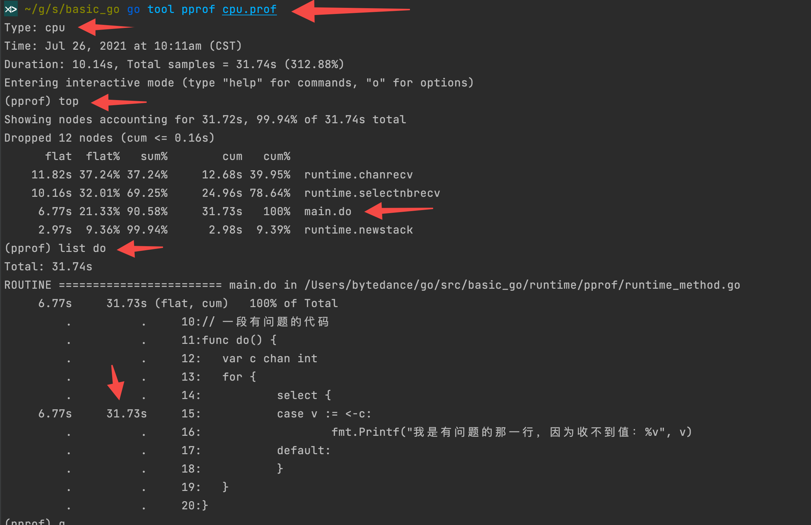
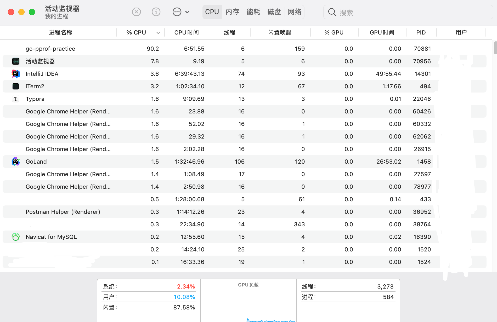

# 性能要素-pprof-practice
> https://debug-lixiwen.github.io/2021/07/18/shi-zhan/#toc-heading-20

# 6 采样的数据内容
不管是前文哪种方式获取，都可以进行分析。这里http的方式把可以看到的信息全部都列出来了。

| 类型         | 描述                                                                                                            | url                                    |
| ------------ | --------------------------------------------------------------------------------------------------------------- | -------------------------------------- |
| allocs       | 内存分配情况的采样信息，过去所有内存抽样情况                                                                    | $host/debug/pprof/allocs?debug=1       |
| blocks       | 阻塞操作情况的采样信息，同步阻塞时程序栈跟踪的一些情况                                                          | $host/debug/pprof/block?debug=1        |
| cmdline      | 显示程序启动命令参数及其参数                                                                                    |                                        |
| goroutine    | 显示当前所有协程的堆栈信息                                                                                      |                                        |
| heap         | 堆上的内存分配情况的采样信息，活动对象的内存分配情况                                                            | $host/debug/pprof/heap?debug=1         |
| mutex        | 锁竞争情况的采样信息，互斥锁持有者的栈帧情况                                                                    | $host/debug/pprof/mutex?debug=1        |
| profile      | cpu占用情况的采样信息，点击会下载文件，cpu profile，点击时会得到一个文件，然后可以用 go tool pprof 命令进行分析 | $host/debug/pprof/profile              |
| threadcreate | 系统线程创建情况的采样信息，创建新 OS 线程的堆栈跟踪情况                                                        | $host/debug/pprof/threadcreate?debug=1 |
| trace        | 程序运行跟踪信息，当前程序执行的追踪情况，点击时会得到一个文件，可以用 go tool trace 命令来分析这个文件         | $host/debug/pprof/trace                |

通过加粗的关键字，很直观可以看到能分析到的数据。

（后文将重点根据cpu的采样信息展开命令行和图形化页面的讨论，其余项将在实战中应用）

# 7 数据分析方式
## 7.1 命令行

核心命令：`go tool pprof <binary> <source>`

binary：**是应用的二进制文件，用来解析各种符号**；

source：代表生成的分析数据来源，可以是本地文件（前文生成的cpu.prof），也可以是http地址（比如：`go tool pprof http://127.0.0.1:9090/debug/pprof/profile`）
> 需要注意的是：较大负载的情况下（要不就故意写故障代码，或者就模拟访问压力）获取的有效数据更有意义，如果处于空闲状态，得到的结果可能意义不大

例子如下
```bash
go build -o havlak1 havlak1.go 
go tool pprof havlak1 havlak1.prof
```
通过工具go tool pprof打开URL或文件后，会显示一个 (pprof)提示符，你可以使用以下命令：
| 命令      | 参数             | 说明                                                                                                                                                                                                                                                                                                          |
| --------- | ---------------- | ------------------------------------------------------------------------------------------------------------------------------------------------------------------------------------------------------------------------------------------------------------------------------------------------------------- |
| gv        | [focus]          | 将当前概要文件以图形化和层次化的形式显示出来。当没有任何参数时，在概要文件中的所有采样都会被显示如果指定了focus参数，则只显示调用栈中有名称与此参数相匹配的函数或方法的采样。 focus参数应该是一个正则表达式需要dot、gv命令，执行下面的命令安装：`Shell12sudo apt-get install graphvizsudo apt-get install gv` |
| `web`     | [focus]          | 生成 svg 热点图片，与gv命令类似，web命令也会用图形化的方式来显示概要文件。但不同的是，web命令是在一个Web浏览器中显示它                                                                                                                                                                                        |
| list      | [routine_regexp] | 列出名称与参数 routine_regexp代表的正则表达式相匹配的函数或方法的相关源代码                                                                                                                                                                                                                                   |
| weblist   | [routine_regexp] | 在Web浏览器中显示与list命令的输出相同的内容。它与list命令相比的优势是，在我们点击某行源码时还可以显示相应的汇编代码                                                                                                                                                                                           |
| top[N]    | [–cum]           | top命令可以以本地采样计数为顺序列出函数或方法及相关信息如果存在标记 –cum则以累积采样计数为顺序默认情况下top命令会列出前10项内容。但是如果在top命令后面紧跟一个数字，那么其列出的项数就会与这个数字相同。默认显示 flat 前10的函数调用，可使用 -cum 以 cum 排序                                                 |
| traces    |                  | 打印所有采集的样本                                                                                                                                                                                                                                                                                            |
| disasm    | [routine_regexp] | 显示名称与参数 routine_regexp相匹配的函数或方法的反汇编代码。并且，在显示的内容中还会标注有相应的采样计数                                                                                                                                                                                                     |
| callgrind | [filename]       | 利用callgrind工具生成统计文件。在这个文件中，说明了程序中函数的调用情况。如果未指定 filename参数，则直接调用kcachegrind工具。kcachegrind可以以可视化的方式查看callgrind工具生成的统计文件                                                                                                                     |
| help      |                  | 显示帮助                                                                                                                                                                                                                                                                                                      |
| quit      |                  | 退出                                                                                                                                                                                                                                                                                                          |

开始分析前文生成的cpu.prof:
```bash
go tool pprof cpu.prof
```


go tool pprof cpu.prof

| 类型     | 描述                                                                     | 举例                                                          |
| -------- | ------------------------------------------------------------------------ | ------------------------------------------------------------- |
| flat     | 该函数占用CPU的耗时，不包含当前函数调用其它函数并等待返回的时间          | selectnbrecv占用CPU的耗时是12.29s                             |
| flat%    | 该函数占用CPU的耗时的百分比                                              | selectnbrecv耗时：12.29s，cpu总耗时：29.14，12.29/29.14=42.18 |
| sum%     | 前面所有flat总和，top命令中排在它上面的函数以及本函数flat%之和           | chanrecv：42.18%+30.47% = 72.65%                              |
| cum      | 当前函数加上该函数调用之前的累计CPU耗时，该指标包含子函数耗时	chanrecv： | 8.88+0.54=9.42                                                |
| cum%     | 当前函数加上该函数调用之前的累计CPU耗时的百分比                          | 9.42/29.14=32.33%                                             |
| 最后一列 | 当前函数名称                                                             | -                                                             |

- 什么时候Flat==cum？Flat是当前函数耗时，Cum是当前函数和调用函数累计耗时，他俩相等，代表当前函数没有调用别的函数。
- 什么时候Flat==0？函数中只有其它函数的调用。

上面的命令解析

**发现do函数有点问题。此时通过命令：`list funcName`，来进行查看具体的位置**

> 1.在前文的对话框中继续输入：web。即可生成pprof001.svg的页面。

> 2.执行命令：go tool pprof -pdf cpu.prof,会生成profile001.pdf的pdf文件。(参数可选text、pdf、svg)，不管哪种形式，都会得到以下图片：


## 7.2 可视化界面方式
> 执行命令：go tool pprof -http=:6060 cpu.prof


- Top （同前文gdb交互页面的top命令）
    

- Graph（同前文gdb交互页面的web命令）
    

- Flame Graph（火焰图）
  - 这里的颜色是随机分布的，只是看起来像火焰。
  - 调用顺序**由上到下**，每一块代表一个函数，越大代表占用 CPU 的时间更长。同时它也可以支持点击块深入进行分析。
  

- Peek（详细=树结构）
  

- Source（同前文gdb交互页面的list FuncName命令）
  

- Disassemble
  

# 8 数据分析实战
## 8.1 排查套路
### 8.1.1 套路1
这里先说一下排查套路。

> 第一步：进入排除对应的gdb交互。

```bash
go tool pprof http://localhost:6060/debug/pprof/{填上你想查看的内容}
```
内容关键字：
| 类型         | 描述                                  |
| ------------ | ------------------------------------- |
| allocs       | 内存分配情况的采样信息                |
| blocks       | 阻塞操作情况的采样信息                |
| cmdline      | 显示程序启动命令参数及其参数          |
| goroutine    | 显示当前所有协程的堆栈信息            |
| heap         | 堆上的内存分配情况的采样信息          |
| mutex        | 锁竞争情况的采样信息                  |
| profile      | cpu占用情况的采样信息，点击会下载文件 |
| threadcreate | 系统线程创建情况的采样信息            |
| trace        | 程序运行跟踪信息                      |

> 第二步：三联招，top->list FuncName->web

通过占用比分析，查看具体代码行数，看大图确认。

> 第三步：解决问题。

（细心的同学可能会发现没有对trace进行分析，这个请期待《一看就懂系列之Golang的trace》）

### 8.1.2 套路2-推荐
将其重新运行起来，然后在其它窗口执行下述命令：

```shell
wget http://127.0.0.1:6060/debug/pprof/profile   
```
默认需要等待 30 秒，执行完毕后可在当前目录下发现采集的文件 profile，针对可视化界面我们有两种方式可进行下一步分析：

该命令将在所指定的端口号运行一个 PProf 的分析用的站点。

```shell
go tool pprof -http=:6001 profile 
```

## 8.2 背景说明
本章节使用WOLFOGRE的文章进行实践。

```bash
git clone github.com/wolfogre/go-pprof-practice
cd $GOPATH/src/github.com/wolfogre/go-pprof-practice
go mod init
go mod tidy
go mod download
go build
./go-pprof-practice
```
运行后注意查看一下资源是否吃紧，机器是否还能扛得住，坚持一分钟，如果确认没问题，咱们再进行下一步。

## 8.3 排查 CPU 占用过高
我们首先通过活动监视器（或任务管理器、top 命令，取决于你的操作系统和你的喜好），查看一下炸弹程序的 CPU 占用：



```bash
wget http://localhost:6060/debug/pprof/profile
go tool pprof -http=:8080 profile
```


很明显，CPU 占用过高是 `github.com/wolfogre/go-pprof-practice/animal/felidae/tiger.(*Tiger).Eat` 造成的。

可以看到，是第 24 行那个一百亿次空循环占用了大量 CPU 时间，至此，问题定位成功！

接下来有一个扩展操作：图形化显示调用栈信息，这很酷，但是需要你事先在机器上安装 graphviz，大多数系统上可以轻松安装它：
```bash
brew install graphviz # for macos
apt install graphviz # for ubuntu
yum install graphviz # for centos
```
至此，这一小节使用 pprof 定位 CPU 占用的实验就结束了，你需要输入 exit 退出 pprof 的交互式终端。

为了方便进行后面的实验，我们修复一下这个问题，不用太麻烦，注释掉相关代码即可：
```GO
func (t *Tiger) Eat() {
    log.Println(t.Name(), "eat")
    //loop := 10000000000
    //for i := 0; i < loop; i++ {
    //    // do nothing
    //}
}
```
之后修复问题的的方法都是注释掉相关的代码，不再赘述。你可能觉得这很粗暴，但要知道，这个实验的重点是如何使用 pprof 定位问题，我们不需要花太多时间在改代码上。

## 8.4 排查内存占用过高
重新编译炸弹程序，再次运行，可以看到 CPU 占用率已经下来了，但是内存的占用率仍然很高：


可以看到这次出问题的地方在 `github.com/wolfogre/go-pprof-practice/animal/muridae/mouse.(*Mouse).Steal`

注释代码就可以了

| 选项名        | 作用                           |
| ------------- | ------------------------------ |
| alloc_objects | 分析应用程序的内存临时分配情况 |
| alloc_space   | 查看每个函数分配的内存空间大小 |
| inuse_space   | 分析应用程序的常驻内存占用情况 |
| inuse_objects | 查看每个函数所分配的对象数量   |

执行该命令后，能够很快的拉取到其结果，因为它不需要像 CPU Profiling 做采样等待，这里需要注意的一点是 Type 这一个选项，你可以看到它默认显示的是 inuse_space，实际上可以针对多种内存概况进行分析，常用的类别如下：

- inuse_space：分析应用程序的常驻内存占用情况。
    ```bash
    ⋊> ~/testpprof go tool pprof -inuse_space http://localhost:6060/debug/pprof/heap 
    Fetching profile over HTTP from http://localhost:6060/debug/pprof/heap 
    Saved profile in /Users/xxx/pprof/pprof.alloc_objects.alloc_space.inuse_objects.inuse_space.003.pb.gz 
    Type: inuse_space 
    Time: Aug 1, 2021 at 9:41pm (CST) 
    Entering interactive mode (type "help" for commands, "o" for options)
    (pprof) 
    (pprof) 
    (pprof) top 
    Showing nodes accounting for 1GB, 100% of 1GB total 
            flat flat% sum% cum cum% 
        `	1GB 100% 100% 1GB 100% github.com/wolfogre/go-pprof-practice/animal/muridae/mouse.(*Mouse).Steal 
            0 0% 100% 1GB 100% github.com/wolfogre/go-pprof-practice/animal/muridae/mouse.(*Mouse).Live 
            0 0% 100% 1GB 100% main.main 0 0% 100% 1GB 100% runtime.main 
    (pprof)
    ```
- alloc_objects：分析应用程序的内存临时分配情况
    ```bash
    ⋊> ~/testpprof go tool pprof -alloc_objects http://localhost:6060/debug/pprof/heap 
    Fetching profile over HTTP from http://localhost:6060/debug/pprof/heap 
    Saved profile in /Users/xxx/pprof/pprof.alloc_objects.alloc_space.inuse_objects.inuse_space.004.pb.gz 
    Type: alloc_objects 
    Time: Aug 1, 2021 at 9:43pm (CST) 
    Entering interactive mode (type "help" for commands, "o" for options) 
    (pprof) 
    (pprof) top 
    Showing nodes accounting for 51, 100% of 51 total flat 
        flat% sum% cum cum% 
        41 80.39% 80.39% 41 80.39% github.com/wolfogre/go-pprof-practice/animal/canidae/dog.(*Dog).Run (inline) 
        10 19.61% 100% 10 19.61% github.com/wolfogre/go-pprof-practice/animal/muridae/mouse.(*Mouse).Steal 
        0 0% 100% 41 80.39% github.com/wolfogre/go-pprof-practice/animal/canidae/dog.(*Dog).Live 
        0 0% 100% 10 19.61% github.com/wolfogre/go-pprof-practice/animal/muridae/mouse.(*Mouse).Live 
        0 0% 100% 51 100% main.main 0 0% 100% 51 100% runtime.main (pprof)
    ```

另外还有 inuse_objects 和 alloc_space 类别，分别对应查看每个函数所分别的对象数量和查看分配的内存空间大小，具体可根据情况选用。


## 8.5 排查频繁内存回收
你应该知道，频繁的 GC 对 golang 程序性能的影响也是非常严重的。虽然现在这个炸弹程序内存使用量并不高，但这会不会是频繁 GC 之后的假象呢？

为了获取程序运行过程中 GC 日志，我们需要先退出炸弹程序，再在重新启动前赋予一个环境变量，同时为了避免其他日志的干扰，使用 grep 筛选出 GC 日志查看：

```bash
GODEBUG=gctrace=1 ./go-pprof-practice | grep gc
```
日志输出如下：


可以看到，GC 差不多每 3 秒就发生一次，且每次 GC 都会从 16MB 清理到几乎 0MB，说明程序在不断的申请内存再释放，这是高性能 golang 程序所不允许的。

如果你希望进一步了解 golang 的 GC 日志可以查看《如何监控 golang 程序的垃圾回收》,为保证实验节奏，这里不做展开。

所以接下来使用 pprof 排查时，我们在乎的不是什么地方在占用大量内存，而是什么地方在不停地申请内存，这两者是有区别的。

由于内存的申请与释放频度是需要一段时间来统计的，所有我们保证炸弹程序已经运行了几分钟之后，再运行命令：
```bash
go tool pprof http://localhost:6060/debug/pprof/allocs
```
同样使用 top、list、web 大法：


可以看到 `github.com/wolfogre/go-pprof-practice/animal/canidae/dog.(*Dog).Run` 会进行无意义的内存申请，而这个函数又会被频繁调用，这才导致程序不停地进行 GC:
```go
func (d *Dog) Run() {
    log.Println(d.Name(), "run")
    _ = make([]byte, 16 * constant.Mi)
}
```
这里有个小插曲，你可尝试一下将 `16 * constant.Mi `修改成一个较小的值，重新编译运行，会发现并不会引起频繁 GC，原因是在 golang 里，对象是使用堆内存还是栈内存，由编译器进行逃逸分析并决定，如果对象不会逃逸，便可在使用栈内存，但总有意外，就是对象的尺寸过大时，便不得不使用堆内存。所以这里设置申请 16 MiB 的内存就是为了避免编译器直接在栈上分配，如果那样得话就不会涉及到 GC 了。

我们同样注释掉问题代码，重新编译执行，可以看到这一次，程序的 GC 频度要低很多，以至于短时间内都看不到 GC 日志了：


## 8.6 排查协程泄露
由于 golang 自带内存回收，所以一般不会发生内存泄露。但凡事都有例外，在 golang 中，协程本身是可能泄露的，或者叫协程失控，进而导致内存泄露。

我们在浏览器里可以看到，此时程序的协程数已经多达 106 条：


虽然 106 条并不算多，但对于这样一个小程序来说，似乎还是不正常的。为求安心，我们再次是用 pprof 来排查一下：

```bash
go tool pprof http://localhost:6060/debug/pprof/goroutine
```
同样是 top、list、web 大法：


可能这次问题藏得比较隐晦，但仔细观察还是不难发现，问题在于 `github.com/wolfogre/go-pprof-practice/animal/canidae/wolf.(*Wolf).Drink` 在不停地创建没有实际作用的协程：

```go
func (w *Wolf) Drink() {
    log.Println(w.Name(), "drink")
    for i := 0; i < 10; i++ {
        go func() {
            time.Sleep(30 * time.Second)
        }()
    }
}
```
可以看到，Drink 函数每次回释放 10 个协程出去，每个协程会睡眠 30 秒再退出，而 Drink 函数又会被反复调用，这才导致大量协程泄露，试想一下，如果释放出的协程会永久阻塞，那么泄露的协程数便会持续增加，内存的占用也会持续增加，那迟早是会被操作系统杀死的。

我们注释掉问题代码，重新编译运行可以看到，协程数已经降到 4 条了：


## 8.7 排查锁的争用
到目前为止，我们已经解决这个炸弹程序的所有资源占用问题，但是事情还没有完，我们需要进一步排查那些会导致程序运行慢的性能问题，这些问题可能并不会导致资源占用，但会让程序效率低下，这同样是高性能程序所忌讳的。

我们首先想到的就是程序中是否有不合理的锁的争用，我们倒一倒，回头看看上一张图，虽然协程数已经降到 4 条，但还显示有一个 mutex 存在争用问题。

相信到这里，你已经触类旁通了，无需多言，开整。

```bash
go tool pprof http://localhost:6060/debug/pprof/mutex
```
同样是 top、list、web 大法：


可以看出来这问题出在 `github.com/wolfogre/go-pprof-practice/animal/canidae/wolf.(*Wolf).Howl`。但要知道，在代码中使用锁是无可非议的，并不是所有的锁都会被标记有问题，我们看看这个有问题的锁那儿触雷了。

```GO
func (w *Wolf) Howl() {
    log.Println(w.Name(), "howl")

    m := &sync.Mutex{}
    m.Lock()
    go func() {
        time.Sleep(time.Second)
        m.Unlock()
    }()
    m.Lock()
}
```
可以看到，这个锁由主协程 Lock，并启动子协程去 Unlock，主协程会阻塞在第二次 Lock 这儿等待子协程完成任务，但由于子协程足足睡眠了一秒，导致主协程等待这个锁释放足足等了一秒钟。虽然这可能是实际的业务需要，逻辑上说得通，并不一定真的是性能瓶颈，但既然它出现在我写的“炸弹”里，就肯定不是什么“业务需要”啦。

所以，我们注释掉这段问题代码，重新编译执行，继续。

## 8.8 排查阻塞操作
好了，我们开始排查最后一个问题。

在程序中，除了锁的争用会导致阻塞之外，很多逻辑都会导致阻塞。


可以看到，这里仍有 2 个阻塞操作，虽然不一定是有问题的，但我们保证程序性能，我们还是要老老实实排查确认一下才对。
```bash
go tool pprof http://localhost:6060/debug/pprof/block
```
top、list、web，你懂得。


可以看到，阻塞操作位于 `github.com/wolfogre/go-pprof-practice/animal/felidae/cat.(*Cat).Pee`：

```go
func (c *Cat) Pee() {
    log.Println(c.Name(), "pee")

    <-time.After(time.Second)
}
```
你应该可以看懂，不同于睡眠一秒，这里是从一个 channel 里读数据时，发生了阻塞，直到这个 channel 在一秒后才有数据读出，这就导致程序阻塞了一秒而非睡眠了一秒。

这里有个疑点，就是上文中是可以看到有两个阻塞操作的，但这里只排查出了一个，我没有找到其准确原因，但怀疑另一个阻塞操作是程序监听端口提供 porof 查询时，涉及到 IO 操作发生了阻塞，即阻塞在对 HTTP 端口的监听上，但我没有进一步考证。

不管怎样，恭喜你完整地完成了这个实验。

## 9 代码优化建议
以下是一些从其它项目借鉴或者自己总结的实践经验，它们只是建议，而不是准则，实际项目中应该以性能分析数据来作为优化的参考，避免过早优化。

1. 对频繁分配的小对象，使用 sync.Pool 对象池避免分配
2. 自动化的 DeepCopy 是非常耗时的，其中涉及到反射，内存分配，容器(如 map)扩展等，大概比手动拷贝慢一个数量级
3. 用 atomic.Load/StoreXXX，atomic.Value, sync.Map 等代替 Mutex。(优先级递减)
4. 使用高效的第三方库，如用fasthttp替代 net/http
5. 在开发环境加上-race编译选项进行竞态检查
6. 在开发环境开启 net/http/pprof，方便实时 pprof
7. 将所有外部IO(网络IO，磁盘IO)做成异步

