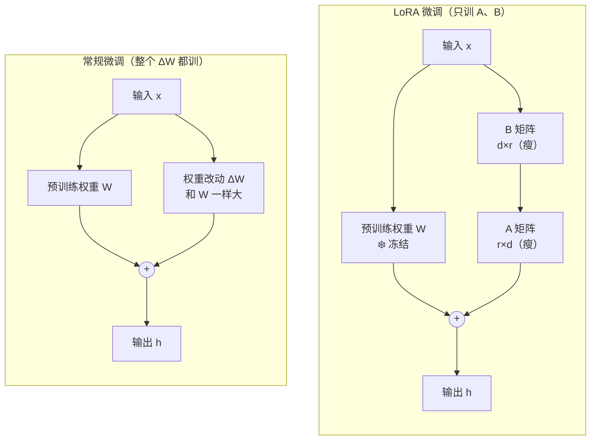
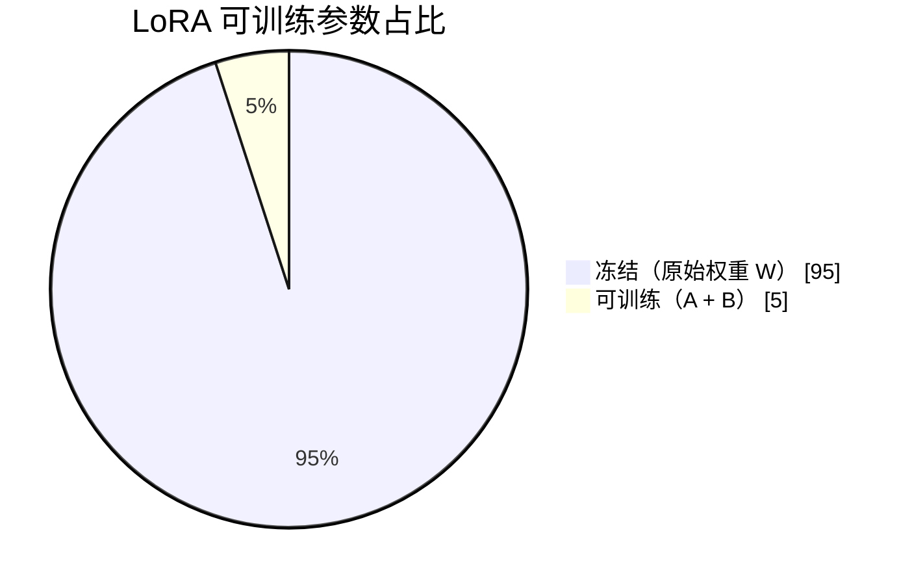

# LoRA 与 QLoRA

> 本页按"概念 → 架构 → 数学原理 → QLoRA → 实战"组织。数学原理一节是**精髓**。

## 一、LoRA 概念起源

- **全称**:Low-Rank Adaptation(低秩自适应)
- **核心痛点**:全量微调大模型(如 Llama 70B)显存消耗巨大、算力成本难以负担。
- **核心思想**:**保持原参数不变**,利用线性代数中的"低秩矩阵"分解,作为一个外挂的 Adapter 来学习任务改动。

一句话:不去改那个庞大的原始权重 W,而是在旁边挂一个**很小的**模块来表示"该怎么改"。

## 二、架构对比:常规微调 vs LoRA

两者前向传播都是 `输出 = W·x + 改动量·x`,区别在"改动量"怎么来。



- **常规微调**:改动量 `ΔW` 是一个和 `W` **同样大**的矩阵,要整个训练。
- **LoRA**:把 `ΔW` 拆成两个瘦长矩阵 `A`、`B`(中间维度是 `r`),用 `A·B` 来表示 `ΔW`。原始 `W` 冻结,**只训练 A、B**。

### 参数占比:LoRA 的"魔法"



模型 95% 的参数冻结不动,只训练约 5%(甚至更少)。这就是"LoRA 的魔法"。

## 三、数学原理（精髓）⭐

这是整篇最关键的一节。LoRA 能省参数,全靠**低秩分解**:

一个大矩阵可以近似拆成两个小矩阵相乘:

```
[ N × D ]  ≈  [ N × r ]  @  [ r × D ]
  大矩阵         瘦高          矮宽
              （A）          （B）
```

`@` 是矩阵乘法。关键在中间维度 **r(秩,rank)很小**,所以两个小矩阵的参数总量 `N×r + r×D` 远小于原来的 `N×D`。

### 给精髓算一笔账

假设权重矩阵 `N = 1024`、`D = 512`,取 `r = 8`:

| | 参数量 | 计算 |
|---|---|---|
| 原始 ΔW(N×D) | **524,288** | 1024 × 512 |
| LoRA 的 A+B(N×r + r×D) | **12,288** | 1024×8 + 8×512 |

> [!key-insight] LoRA 的精髓
> 同样表达"权重该怎么改",等号左边要训 **52 万**个数,右边只要训 **1.2 万**个 —— 降到约 **2.3%**,省掉 97.7%。而效果几乎不掉。
> 本质:**模型适配一个新任务,真正需要改动的信息量很小(低内在秩)**,所以能用一个"瘦腰" r 把改动量压缩掉。

### 秩(Rank)怎么选

LoRA 原论文做过 r 从 1 到 1024 的实验(数据集:E2E NLG):

| Rank r | val_loss | BLEU | CIDEr |
|--------|----------|------|-------|
| 1 | 1.23 | 68.72 | 2.4329 |
| 2 | 1.21 | 69.17 | 2.4639 |
| **4** | 1.18 | **70.38** | **2.5349** |
| 8 | 1.17 | 69.57 | 2.5196 |
| 16 | 1.16 | 69.61 | 2.4985 |
| 32 | 1.16 | 69.33 | 2.5255 |
| 64 | 1.16 | 69.24 | 2.5070 |
| 1024 | 1.17 | 69.57 | 2.5090 |
 
> [!key-insight] r 不是越大越好
> r 增大后指标并没有持续变好(r=4 时 BLEU/CIDEr 甚至最高)。**推荐 r 取 4~32**,这正是低秩假设的实证:任务适配所需的内在秩很低。

> [!key-insight] 4~32 之间到底取哪个
> 实践中**首选 `r = 16` 或 `r = 32`**(主流工具如 Unsloth/PEFT 的推荐默认起点),按任务复杂度和显存微调:
> - **简单任务**(指令遵循、风格模仿)→ `r = 8` 或 `16`:训练快、省显存。
> - **标准 / 平衡任务** → `r = 16` 或 `32`:精度与资源的最佳折中,**最常用**。
> - **复杂任务**(多领域、复杂推理)→ `r = 32`,显存够可上 `64`。
> - ⚠️ r 过大反而会**过拟合**、拖慢训练且收益递减。实战建议从 **16 起步**,效果不够再往上加。
> - 配套 `α`:取 `α = r`(比值 1)或 `α = 2r`(比值 2),见下一节。

### 权重初始化与缩放更新公式

完整的 LoRA 更新公式是:

```
W_LoRA = W + (α / r) · ΔW        （ΔW = B·A）
```

各部分含义:

| 项 | 形状 | 初始化 | 说明 |
|---|---|---|---|
| `W` | N×D | 预训练值,**冻结** | 原始权重,不更新 |
| `B` | N×r | **全零初始化** | 训练开始时让 ΔW=0 |
| `A` | r×D | **随机数初始化** | 提供初始的随机方向 |

> [!key-insight] 为什么 B 全零、A 随机
> 训练刚开始时 `ΔW = B·A = 0`(因为 B 全零),所以 `W_LoRA = W` —— **模型起点和原始模型完全一致,不会因为加了 Adapter 就"乱掉"**。随后 B 从零开始被梯度逐步更新,改动量平滑地长出来。若 A、B 都为零则梯度永远为零学不动,所以 A 用随机数打破对称。

### α(alpha)与缩放

公式里的 `α / r` 是缩放系数,作用相当于调节 LoRA 改动量的**有效学习率**:

- 比值**越大** → ΔW 被整体放大,等于有效学习率越高,模型适应任务越快,但容易**动荡 / 过拟合**。
- 比值**越小** → 改动越**温和**,更稳但收敛慢、学不充分。
- 所以目标是调到一个**合适的值**,在"快"和"稳"之间平衡。

> [!key-insight] 常用经验值
> - **`α = 2r`(即 `α/r = 2`)**:最常用的安全默认值,适合小 r、小数据、偏风格类任务。HuggingFace PEFT 等很多教程的默认起点。
> - **`α = r`(即 `α/r = 1`)**:"**不缩不放**",ΔW 原样加上去,偏保守稳健。
> - **rsLoRA 的做法**:按 `α / √r` 缩放(而非 `α / r`),在较大 r 时训练更稳定,理论上更优。
> - 真正起作用的是**比值 `α/r`,而不是 α 本身**;调好比值后,改 α 就能整体放缩强度,**不必重训** A、B。

## 四、QLoRA = 量化 + LoRA

### 一句话定义

> **QLoRA(Quantized LoRA)在 LoRA 的基础上引入"量化"技术:把预训练模型的权重压缩成 4-bit 精度来减少显存占用,同时保留 LoRA 的低秩更新机制来实现参数高效微调。**

注意:**QLoRA 不是另起炉灶,而是 LoRA 的"省显存增强版"**。上图里那个挂在大矩阵旁边的 `B(全零)@ A(随机)` 低秩结构和 LoRA 完全一样 —— QLoRA 只动了"那块冻结的大权重 W 怎么存"。

### 它为什么存在:LoRA 还不够省

LoRA 已经把"**要训练**的参数"砍到 1% 左右,但有个东西它没省到:**那块冻结的原始权重 W 本身**。

- 一个 70B 模型,光是把 W 用 FP16 加载进显存就要约 **140GB** —— 哪怕一个参数都不训,显存也先爆了。
- LoRA 省的是"梯度/优化器状态",省不了"模型本体的存储"。

> [!key-insight] QLoRA 存在的唯一目的
> **让"加载并微调一个超大模型"这件事,能在一张消费级/单张显卡上完成。**
> 它瞄准的痛点正是 LoRA 没解决的那一半:把冻结的 W 从 16-bit 压到 4-bit,存储直接降到 ≈1/4。这就是视频里说的"**这就是 QLoRA 存在的唯一目的**"。

### QLoRA vs LoRA:到底差在哪

| 维度 | LoRA | QLoRA |
|---|---|---|
| 原始权重 W 怎么存 | FP16/BF16(16-bit) | **NF4(4-bit)量化存储** |
| 适配器 A、B | FP16 训练 | FP16 训练(**不变**) |
| 低秩更新机制 | `ΔW = B·A` | `ΔW = B·A`(**完全一样**) |
| 70B 模型显存 | 约 80GB | **约 48GB**(单卡可跑) |
| 精度 | 略高 | 几乎无损(NF4 设计得当) |
| 训练速度 | 快 | 略慢(多了反量化步骤) |

一句话:**唯一的区别就是"W 用几位存"**;训练的部分、低秩思想、前向公式都没变。

### QLoRA 的三大核心技术

QLoRA 能做到"4-bit 还几乎不掉精度",靠三个关键设计:

1. **NF4(4-bit NormalFloat)量化**
   普通 INT4 是均匀分块,但神经网络权重近似**正态分布**(中间密、两头稀)。NF4 是一种"信息论最优"的量化方式,按正态分布的分位点切档,让 4 个 bit 用在刀刃上,精度损失远小于普通 INT4。

2. **双重量化(Double Quantization)**
   量化会产生一批"缩放系数(量化常数)",这些常数本身也占显存。QLoRA **对量化常数再量化一次**,平均每个参数再省约 0.37 bit —— 量化的元数据也不放过。

3. **分页优化器(Paged Optimizers)**
   训练中偶发的显存峰值(如长序列)容易 OOM。借助 NVIDIA 统一内存,把优化器状态在**显存和内存之间自动换页**,峰值时溢到内存,避免训练崩溃。

> [!key-insight] 反量化:计算时怎么办
> W 虽然以 4-bit **存储**,但参与矩阵运算时会**临时反量化回 FP16** 再算 —— 即"**4-bit 存、16-bit 算**"。所以省的是显存占用,换来的代价是多一步反量化、速度略慢。原论文成果:用 QLoRA 在**单张 48GB 显卡**上微调了 65B 模型,且效果与 16-bit 全精度微调相当。

### 量化是什么(直观理解)

> [!key-insight] 量化是什么
> 把每个权重数字从 16 位(FP16)压成 4 位(NF4),存储空间约降到 1/4。代价是精度略损,但因为 W 是**冻结的**(不参与梯度更新),量化误差影响有限 —— 这也是为什么"量化冻结权重 + 高精度训练适配器"这套组合能成立。

### QLoRA 的四大核心优势

| 优势 | 说明 |
|---|---|
| **① 极低内存,支持大模型微调** | 靠 4-bit 量化 + 双重量化,能在**消费级 GPU**(如 A100 24GB)上微调 70B 这种超大模型,显存比全量微调降低**数个数量级**,大幅拉低硬件门槛。 |
| **② 高参数效率与轻量训练** | 只训 LoRA 的低秩矩阵,新增参数仅占总量 **0.01%~1%**,存档只有几 MB 到几十 MB,高效低成本。 |
| **③ 高性能 + 低推理开销** | 文本生成/分类/对话等任务上性能**接近甚至媲美全量微调**;且 LoRA 更新可**合并回量化权重**,推理时无额外计算层,**延迟几乎不变**。 |
| **④ 模块化设计 + 强知识保留** | 可为不同任务训练独立的 QLoRA 模块,**共享同一个量化底模**,便于切换和部署;冻结的量化权重有效保留预训练知识,**增强泛化、降低过拟合**。 |

> [!key-insight] 一句话串起来
> 优势①是它的"立身之本"(省显存),②③④是顺带白拿的好处。其中④说明了**多业务部署**的杀手锏:一个量化底模 + N 个几十 MB 的小适配器,就能服务 N 个任务(呼应 [[全量微调与高效微调]] 里的多任务部署成本对比)。

## 五、显存与选型(实战)

| 模型 | LoRA(FP16) | QLoRA(INT4) | 参考显卡 |
|------|-----------|-------------|---------|
| 7B | 约 16GB | 约 6GB | RTX 4090 / 3060 |
| 13B | 约 32GB | 约 12-13GB | RTX 4090 / A100(40GB) |
| 70B | 约 80GB | 约 48GB | H100 / L40(48GB),单卡 24GB 也能跑 QLoRA |

LoRA 训练速度比全量微调快 3-5 倍;推理时 A、B 可合并回 W,**无额外延迟**。

> [!key-insight] 选型口诀
> - 显存够、追求训练稳定/精度 → **LoRA**
> - 显存紧张、要在消费级显卡上微调大模型 → **QLoRA**
> - QLoRA 在复杂推理任务上可能有轻微精度损失,简单任务基本无差异。

## 六、代码实现

LoRA 最常"附着"的地方是 Transformer 里 **Attention 的 Q/K/V 投影层**。下面分两层看:先用裸 PyTorch 理解原理,再看实战里真正怎么写。

### 1. 原理演示:手写 QKV 的低秩矩阵

对 `Wq / Wk / Wv` 每个权重各挂一组 A、B(回忆:**B 全零、A 随机**,保证起点 ΔW=0):

```python
import torch
import torch.nn as nn

# 为 Wq, Wk, Wv 初始化 LoRA 低秩矩阵（d=隐藏维度, r=秩）
lora_query_matrix_B = nn.Parameter(torch.zeros(d, r))   # B: 全零初始化
lora_query_matrix_A = nn.Parameter(torch.randn(r, d))   # A: 随机数初始化

lora_key_matrix_B   = nn.Parameter(torch.zeros(d, r))
lora_key_matrix_A   = nn.Parameter(torch.randn(r, d))

lora_value_matrix_B = nn.Parameter(torch.zeros(d, r))
lora_value_matrix_A = nn.Parameter(torch.randn(r, d))

# 生成 Wq, Wk, Wv 的改动量 ΔW = B @ A
lora_Wq = lora_query_matrix_B @ lora_query_matrix_A
lora_Wk = lora_key_matrix_B   @ lora_key_matrix_A
lora_Wv = lora_value_matrix_B @ lora_value_matrix_A

# 前向时：h = (W + (alpha/r) * ΔW) @ x，原始 W 冻结，只训 A、B
```

> [!key-insight] 为什么是 Q/K/V
> 注意力层的 Q/K/V 投影是模型"理解任务"的关键开关,在这里挂 LoRA 性价比最高。原论文实验也表明:**只在 Wq、Wv 上加 LoRA,效果就接近全部都加**,所以实战常只选 `q_proj`、`v_proj`(刻意不选 k_proj),用最少的参数拿到大部分收益。

### 2. 实战:用 HuggingFace PEFT(几行搞定)

真实项目里不用手写上面这些,直接用 `peft` 库声明一个 `LoraConfig` 即可。这里给图里那种**全模块**写法(Attention + FFN 都挂):

```python
from peft import LoraConfig, get_peft_model

lora_config = LoraConfig(
    alpha=32,                 # α 缩放系数（视频示例里写 alpha=1，实战常取 r 或 2r）
    r=8,                      # 秩，常用 8/16/32
    target_modules=[
        # —— Attention 四件套 ——
        "q_proj",             # Query 投影
        "k_proj",             # Key 投影
        "v_proj",             # Value 投影
        "o_proj",             # 输出投影
        # —— FFN（前馈层）三件套 ——
        "gate_proj",
        "up_proj",
        "down_proj",
    ],
    task_type="CAUSAL_LM",    # 因果语言模型（生成类）
)

model = get_peft_model(base_model, lora_config)
model.print_trainable_parameters()    # 看一眼：可训练参数通常只占 0.1%~1%
```

> [!key-insight] target_modules 是最重要的参数
> 它决定"给哪些层挂 LoRA"。挂得越多,可调参数越多、表达力越强,但显存/计算也越高。常见档位:
>
> | 档位 | target_modules | 适用 |
> |---|---|---|
> | 最省 | `q_proj, v_proj` | 中等任务、最常见默认,只动 Q、V |
> | 全 Attention | `q/k/v/o_proj` | 注意力整层都调,效果更稳 |
> | 全模块(图中所示) | Attention + `gate/up/down_proj`(FFN) | 复杂任务/追求最佳效果,接近全量微调能力 |
>
> 一句话:**先用 `q_proj, v_proj` 起步,不够再逐步加 `o_proj` 和 FFN 层。**

#### target_modules 里每个模块逐项详解

这些名字都是 Transformer 块里的**线性投影层**,分属两大子模块:**Attention(注意力)** 和 **FFN(前馈网络)**。

**① Attention 注意力部分**

| 模块名 | 全称 | 作用 | 通俗理解 |
|---|---|---|---|
| `q_proj` | Query 投影 | 把输入投影成"查询"向量 | 我**想找什么**信息 |
| `k_proj` | Key 投影 | 把输入投影成"键"向量 | 每个词**能提供什么**信息(用来被匹配) |
| `v_proj` | Value 投影 | 把输入投影成"值"向量 | 匹配上之后**真正取出的内容** |
| `o_proj` | Output 投影 | 把多头注意力的结果**汇总输出** | 把各注意力头的结论**拼回去** |

> Q、K、V 三者算注意力分数:`Attention = softmax(Q·Kᵀ/√d)·V`;`o_proj` 在算完之后做最后的整理输出。

**② FFN 前馈网络部分**(现代模型多用 SwiGLU 结构,所以是三个)

| 模块名 | 全称 | 作用 | 通俗理解 |
|---|---|---|---|
| `gate_proj` | 门控投影 | 算一个"门控"信号,决定哪些特征放行 | **闸门**:控制信息通过的程度 |
| `up_proj` | 升维投影 | 把维度**放大**(如 4096→11008)做特征扩展 | **打开**:展开成更高维做加工 |
| `down_proj` | 降维投影 | 再把维度**压缩**回原大小 | **收回**:加工完压缩回去 |

> FFN 计算可记为:`down_proj( gate_proj(x) ⊙ up_proj(x) )` —— gate 当闸门、up 升维、down 降维收尾。

#### 一般怎么搭配

| 搭配 | 模块组合 | 思路 / 适用 |
|---|---|---|
| **经典最省** | `q_proj` + `v_proj` | LoRA 原论文结论:只调 Q、V 就接近全调效果。性价比最高,**首选默认** |
| **全注意力** | `q_proj` + `k_proj` + `v_proj` + `o_proj` | 注意力整层都微调,任务稍复杂时更稳 |
| **注意力 + FFN(全模块)** | 上面 4 个 + `gate_proj` + `up_proj` + `down_proj` | FFN 是模型存"知识"的地方;**注入新领域知识、复杂任务**时加上,效果最接近全量微调 |
| **只调 FFN** | `gate/up/down_proj` | 较少单独用,适合"补知识但不改注意力模式"的特殊场景 |

> [!key-insight] 搭配口诀
> - **改"怎么关注/理解"** → 调 Attention(q/v 起步,再加 k/o)。
> - **补"新知识/事实"** → 加 FFN(gate/up/down)。
> - 实战路径:`q,v` → 不够加 `o` → 还不够把 `k` 和 FFN 三件套全开。开得越多越强但越费显存。

### 3. QLoRA:再加一步 4bit 量化加载

QLoRA 只是在上面的基础上,加载 base 模型时用 4bit 量化:

```python
from transformers import AutoModelForCausalLM, BitsAndBytesConfig

bnb_config = BitsAndBytesConfig(
    load_in_4bit=True,                 # 权重量化为 INT4 存储
    bnb_4bit_quant_type="nf4",         # QLoRA 论文提出的 NF4 量化
    bnb_4bit_compute_dtype=torch.float16,  # 计算时用 FP16
)
base_model = AutoModelForCausalLM.from_pretrained(
    "model_name", quantization_config=bnb_config
)
# 之后再套用上面的 LoraConfig / get_peft_model 即可
```

> [!key-insight] 实战记忆点
> - `target_modules` 选 `["q_proj", "v_proj"]` 是中等任务的常见默认,要更强可加 `k_proj`、`o_proj` 乃至 FFN 层。
> - `r` 从 16 起步,`lora_alpha` 设 `2*r`。
> - QLoRA = `LoraConfig` + `BitsAndBytesConfig(load_in_4bit=True)`,其余代码几乎不变。

## 七、最佳实践指南

把全篇要点收成五条可落地的原则:

| #   | 原则             | 怎么做                                                             |
| --- | -------------- | --------------------------------------------------------------- |
| 1   | **参数最小化**      | 坚持 LoRA 轻量化思想,在保证效果的前提下**尽量减少可训练参数**(小 r、按需挂模块)。                |
| 2   | **工具标准化**      | 优先用 **HuggingFace PEFT 库**,靠标准化接口降低编码复杂度,几行配置就能跑微调,别手搓。         |
| 3   | **全线性层覆盖**     | 追求效果时,建议对**所有线性层**(q/k/v/o + gate/up/down)都挂 LoRA,最大化特征提取与适应能力。 |
| 4   | **细节决定成败**     | 让 **Bias(偏置)和 Layer Norm(层归一化)保持可训练**,这对训练的稳定性与适应性很关键。          |
| 5   | **QLoRA 降本增效** | 用 QLoRA 量化大幅降显存,在**消费级 GPU** 上解锁更大参数规模模型的训练 —— **最主流、最经济**的方案。  |

> [!key-insight] 第 4 条详解:为什么要放开 Bias 和 LayerNorm
> LoRA 默认(`bias="none"`)是**只训 A、B,其余全冻结**。这一条是个**补充例外**:在几乎全冻结的基础上,额外松绑 Bias 和 LayerNorm 这两小撮参数。
> - **它们是什么**:`Bias` 是线性层 `y = W·x + b` 里那个小小的偏置向量(做平移);`LayerNorm` 把每层数值拉回稳定分布(均值0方差1),靠 `γ`(缩放)、`β`(平移)两个可学习参数微调。两者参数量都**极少**。
> - **A、B 在调"内容"(怎么理解);Bias/LayerNorm 在调"音量和基准线"**:
>   - **LayerNorm 管尺度/稳定性**:新任务数据分布和预训练不同,放开 `γ/β` 能把各层数值快速校准到舒服范围 → **训练更稳、收敛更快、不易发散**。
>   - **Bias 管基线平移**:放开 `b` 能对每个输出维度做整体偏移,以极小代价提升对新任务的**适应性**。
> - **本质是"四两拨千斤"**:花几万个参数换来稳定性和适应性的明显提升,所以叫"细节决定成败"。
> - **实战开法**(PEFT):`LoraConfig(bias="lora_only")` 让偏置参训;`modules_to_save=["norm"]` 让归一化层保持完整可训练。

> [!key-insight] 一句话总结全篇
> **LoRA 用低秩分解把"要训练的参数"砍到 ~1%,QLoRA 再用 4-bit 量化把"要加载的权重"砍到 ~1/4。** 二者叠加,就是当下在单卡上微调大模型最主流、最经济的组合拳。

## 继续学习

- 上一篇:[[全量微调与高效微调]](LoRA 属于 PEFT 的"重参数化"类)
- [[大模型微调概述]]
- [[灾难性遗忘]](LoRA 冻结主体权重,天然缓解遗忘)
- [[LoRA原始论文]](Hu et al. 2021, arXiv:2106.09685)
- 综合页:[[Research: 大模型微调]]
