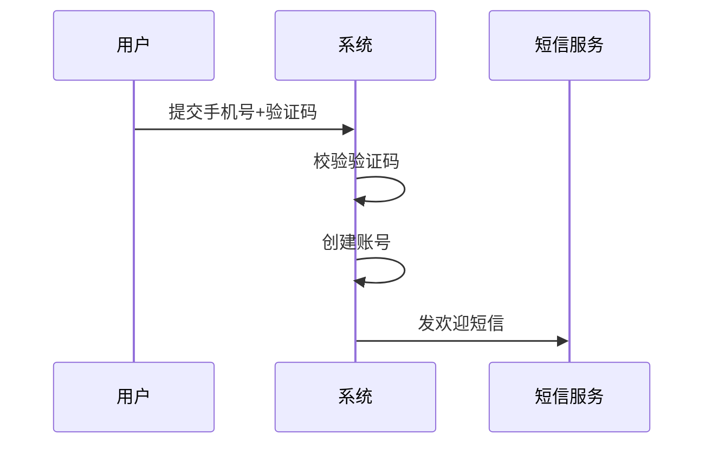

# 18 文档生成规范——产品语言编写与迭代穿插

> 本文定义追史系统生成文档的完整规范：正文纯产品语言、迭代用正文穿插、审阅按标识符着色、复现靠外链回溯代码。
> 本规范直接体现为 agent 的系统提示词（system prompt），是追史质量的核心保障。

---

## 一、初心

当一个项目有十几个服务，要做方案时只能看代码。代码是给机器执行的，不是给人理解的。一个功能的逻辑分散在路由→校验→控制器→Service→Model 五个文件里，要跳来跳去拼上下文。

这个知识库就是那本"中文手册"——把代码翻译成人能读的语言，不看代码就能理解每个服务的主链路、策略、分层结构。

**核心约束**：文档不能错。错了比没有文档更危险——它看起来对，但会误导决策。

---

## 二、生成单位：一件件事，不是一个个 commit

一篇文章代表"一件事"，不是一个 commit ID。多个 commit 可能合并成一件事——比如新建抽象类、新增子类、加 debounce 是三件事，但如果属于同一个功能点的演进，就是一篇文档的一层。

agent 识别"下一件事是什么"——可能是一个 commit，也可能是几个连续 commit 聚合而成。这件事写完了就停，进入审阅队列。审阅通过后才能开始下一件事。

## 二、正文纯产品语言

### 2.1 零代码术语

正文不出现 class、function、Service、Controller、Model、import 等任何开发术语。非开发人员能直接读懂。

**正确写法**：

> 用户提交手机号和验证码后，系统先检查验证码是否正确，不正确直接返回"验证码错误"。
> 验证码通过后，系统检查这个手机号是否已注册。如果已注册，返回"该手机号已存在"。
> 如果未注册，系统创建新账号，同时生成初始化数据，然后发欢迎短信。
> 如果发短信失败，不影响注册成功——短信会在后台重试。

**错误写法**：

> 控制器 `RegisterController.handle()` 调用 `SmsService.verify()` 校验验证码...

### 2.2 写正向链路和策略分支

- 写"做了什么事"，不是"调了什么方法"
- 策略分支要写清楚："当 X 时走 A（见 1.1），当 Y 时走 B（见 1.2）"
- 错误处理、参数校验等琐碎分支一笔带过或不写

### 2.3 有图加图有表加表有列表加列表

- 流程图、时序图用 Mermaid 画
- 对比信息用 Markdown 表格
- 步骤、清单、枚举用列表（有序或无序）
- 目标是整个文档清晰可读

**列表的使用场景**：

有序列表（步骤）：

> 1. 用户提交手机号和验证码
> 2. 系统校验验证码
> 3. 系统创建新账号
> 4. 系统发送欢迎短信

无序列表（功能清单）：

> - 支持 Excel 和 CSV 两种格式
> - 单次最多 1000 条
> - 重复数据自动跳过

### 2.4 文档结构：时序图开头 + 编号展开

每篇文档最开始放一张 Mermaid 时序图，展示整个功能的全局主链路——第一步干什么、第二步干什么、第三步干什么。然后下面用编号展开每一步的细节：

- 一级标题 `## 1.` = 第一步
- 二级标题 `### 1.1` = 子步骤
- 三级标题 `### 1.1.1` 或 `####` = 小分支
- 四级、五级标题 = 更小的分支

这样目录树天然清晰，读者进来先看时序图看全貌，再展开看细节。

```markdown
## 文档开头



## 1. 提交注册信息

（描述）

### 1.1 手机号校验

（描述）

#### 1.1.1 格式校验

（描述）

## 2. 创建账号

（描述）
```

### 2.5 编号引用

大分支用编号引用，不把所有内容塞在一段里：

> ## 1. 用户注册
>
> 注册流程分两种情况：
> - 验证码正确：见 1.1
> - 验证码错误：见 1.2
>
> ### 1.1 验证码正确
>
> 系统创建新账号...
>
> ### 1.2 验证码错误
>
> 直接返回错误...

---

## 三、外链回溯代码

### 3.1 frontmatter 锚链

每篇文档的 frontmatter 记录 commit hash 和文件列表：

```yaml
---
commits: [abc1234]
repo: interact_ecology_agent_llm_server
files:
  - src/controller/register.go
  - src/service/user.go
  - src/service/sms.go
---
```

### 3.2 正文外链

正文中关键断言旁边附外链锚点，指向具体 commit 的具体文件。开发人员点外链直接跳到代码，不需要猜功能在哪实现：

> 用户注册后系统会发欢迎短信 ↗ [abc1234 · src/service/sms.go]

> 批量导入支持 Excel 和 CSV ↗ [def5678 · src/service/import.go]

这样文档正文是产品语言，但每个关键点都能回溯到代码。

---

## 四、按代码层级分领域，场景按入口写

### 4.1 目录按代码层级分

史实目录从仓库到文件共三级（详见 [[11 物理隔离与磁盘布局——三级目录与共享clone#10-史实/ 的目录层级]]）：

1. **第一级是仓库**——一个仓库一个目录，用 `@` 前缀标记
2. **第二级是主领域**——按代码层级分，不是按功能分、不是按场景分
3. **第三级是子领域**——具体模块名，只有当一个主领域下内容多到需要拆时才建
4. **不需要拆的直接放文件**——一个主领域下只有一篇文档时，不建子目录

主领域（代码层级）枚举：

| 主领域 | 对应代码什么部分 | 举例 |
|--------|------------------|------|
| 主进程启动 | 进程入口、初始化、注册、配置加载 | `main.go`、`start.sh` |
| 控制器层 | 路由注册、请求校验、控制器分发 | `controller/`、`interfaces/` |
| 数据校验层 | Request 类型定义、字段校验逻辑 | `request/`、`entity/request/` |
| 服务层 | 业务逻辑、领域服务 | `service/`、`logic/` |
| 抽象层 | 公共抽象、接口定义、设计模式 | `framework/`、`interfaces/` |
| 组件层 | 中间件、filter、钩子、插件 | `components/`、`middleware/` |
| 数据层 | 数据访问、持久化、缓存 | `repo/`、`store/` |
| 数据定义层 | 数据结构定义、模型实体、表结构映射 | `entity/`、`model/`、`domain/` |
| 数据转换层 | Response 类型定义、内部模型→外部响应转换（Translator） | `response/`、`translator/`、`entity/response/` |
| 工具层 | 工具函数、辅助方法 | `utils/`、`helpers/` |
| 配置层 | 配置结构、配置加载 | `conf/`、`entity/appstruct/` |
| 错误码 | 错误定义 | `entity/errcode/` |

不是每个仓库都有全部层级。有内容才建目录，没内容不建空目录。

### 4.2 场景文档按入口写

一个场景从入口到出口完整写在一篇文档里。从哪层进入就从哪层开始写，一路写到最底层，一篇写完全链路。中间遇到复用的功能，用外链引用，不展开。

### 4.3 复用功能抽独立文件

一个功能满足两个条件才抽成独立文件：**独立**（有自己的演进轨迹）+ **复杂**（值得单独说清楚）。抽出来的文件放到对应代码层级的主领域下，原场景文档改为外链引用。简单的不抽，写进场景文档里。

### 4.4 文档内标注代码层级

文档里标注涉及哪些代码层级，但不按层拆文件——一个场景的全链路写在一篇里。

### 4.5 每篇文档标注生命周期

每篇文档开头标注这个功能是长驻型还是会话级：

> 生命周期：长驻 — 进程启动时创建，常驻内存

> 生命周期：会话级 — 请求来了创建，请求完成即销毁

---

## 五、迭代方式：正文穿插

### 5.1 不用末尾追加

末尾追加要求读者在脑子里把追加内容和正文拼起来，认知负担大。正文穿插让结构始终保持完整，读一篇文档就能看到当前全貌。

### 5.2 标识符格式

穿插块用带 commit ID 的箭头标记，开始和结束一一对应：

```
→ [abc1234] 2026-03-15 新增批量导入
批量导入支持 Excel 和 CSV 两种格式，上传后系统先校验文件格式...
← [abc1234]
```

**新增**用 `→ [commit] 日期 描述` / `← [commit]`：

```
→ [abc1234] 2026-03-15 新增批量导入
（新增内容）
← [abc1234]
```

**移除**用 `→ [commit] 日期 移除 描述` / `← [commit]`：

```
→ [def5678] 2026-04-20 移除 批量导入
（移除说明）
← [def5678]
```

### 5.3 嵌套

穿插块可以嵌套。内层块可以出现在外层块内部，agent 自行决定穿插位置以保持文档连贯。例如：

```
→ [abc1234] 2026-01-15 新增用户注册
（注册流程描述）
  → [def5678] 2026-03-15 新增批量导入
  （批量导入描述）
  ← [def5678]
（注册流程剩余部分）
← [abc1234]
```

### 5.4 插入位置

agent 生成时自行决定穿插位置，可以插在章节之间，也可以嵌套在已有块内部。目标是保持文档结构连贯可读。

---

## 六、审阅方式：git diff

审阅时直接用 git diff 看改动，原生的红绿着色已经够清楚——绿色是新增，红色是删除。不需要自己搞着色逻辑。

标识符（`→ [commit]` / `← [commit]`）不是给审阅用的，是给 agent 后面做简史时读的——agent 读标识符就知道"这个功能是什么时候加的、什么时候删的"，用来理解演进脉络。

如果审阅时发现之前文档有问题（不是当前 commit id 提交的），直接改原文，不加标识符。git diff 审阅时自然看得到改了哪里。这种情况是修正，不是功能新增或移除，不属于简史范畴。

---

## 六、复现 = 文档理解主链路 + 外链回溯代码

文档不是用来逐行复现代码的。文档的作用是：

1. **理解主链路**——系统做什么、怎么走、什么策略
2. **回溯具体实现**——通过外链锚点跳到 commit + 文件，看代码细节

开发人员读完文档后知道"这个功能在哪一层、做什么事、什么策略分支"，需要看实现时点外链跳过去看代码。

---

## 七、质量保障：每次全量校验

### 7.1 每次生成都是全量校验

每追一个 commit ID，agent 都要从头到尾根据当前代码整体质检，不是只看 diff。如果发现跟之前文章不一致，暴露问题、给标识符、做修补。

不是"在旧文章上加一块"，而是"从代码出发重新理解，发现矛盾就修"。

### 7.2 自检

agent 写完后回答固定问题：

- 正文有没有出现代码术语？（class/function/Service 等）
- 每个策略分支有没有写清楚条件？
- 外链是否覆盖了所有关键断言？
- 有没有写了"调用某某"但没写"做什么"？

### 7.3 外链校验

正文里每个外链 `↗ [commit · file]`，校验脚本读文档 → 提取外链 → git checkout 到对应 commit → 读文件 → 匹配描述。如果文件不存在或描述跟代码矛盾，标记为质量问题。

### 7.4 发现不一致时的处理

当 agent 发现文档与代码不一致时：

1. 暴露问题，给出明确标识符，标记"与之前代码不一致"
2. 本次进行修补，写清修补路线
3. 修补后的文档进入审阅队列

### 7.5 审阅 = Git 提交

- 每次改动是全量改——涉及哪个功能点就改哪个功能点
- 审阅看的是 diff——增加了哪些行、删除了哪些行
- 审阅通过后合并回去
- 不存在版本迭代的说法，就是改了哪删了哪

---

## 八、提示词分层

规范通过两层提示词落地：系统提示词管"怎么写"，用户提示词管"写什么"。

### 8.1 系统提示词（skill）

系统提示词是写作规范，agent 每次生成都带着。内容是本文档定义的全部规范：

- 正文纯产品语言（第二节）
- 外链回溯代码的格式（第三节）
- 按代码层级分领域，场景按入口写（第四节）
- 迭代用正文穿插，标识符格式（第五节）
- 审阅看 git diff（第六节）
- 每次全量校验、自检、外链校验（第七节）

改系统提示词就是改 skill 文件，不是改插件代码。

### 8.2 用户提示词（每次生成时拼接）

用户提示词是具体任务信息，每次生成都不同。由插件代码拼接：

- 工作空间路径（workspace 目录、knowledge-base 软链、被跟踪仓库路径）
- 当前 commit 信息（hash、日期、作者、主题）
- 任务步骤（checkout → 读代码 → 读 diff → 读已有史实 → 生成 → 写归档路径）
- 草稿文件名

### 8.3 生成流程

1. 插件拼接用户提示词（任务信息 + 步骤）
2. skill 提供系统提示词（写作规范）
3. agent 收到两层提示词后开始工作
4. agent 先 `git checkout <commit>` 切到对应代码版本
5. 读当前层的代码文件
6. 读已有史实文章（理解之前叠了哪些层）
7. 整体思考后，用产品语言写正文 + 外链锚点
8. 自检——挡低级错误
9. 外链校验——挡事实错误
10. 通过则进审阅队列