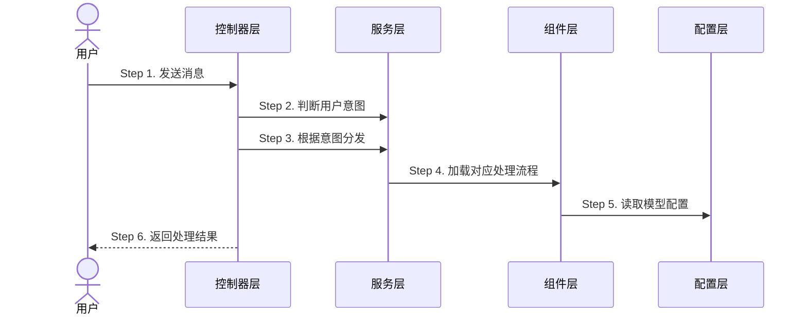

# 18.1 场景文档样例

> 本文给出一个完整的场景文档样例，展示 [[18 文档生成规范——产品语言编写与迭代穿插]] 定义的全部规范如何落地。
> 场景：用户发起对话，系统判断用户意图并分发到对应处理流程。入口在控制器层，全链路写到配置层。

## 目录位置

这篇文档的入口是 tRPC 请求，从控制器层进入，所以放在：

```
10-史实/@interact_ecology_agent_llm_server/控制器层/对话意图识别与分发.md
```

路由层虽然存在，但只是请求转发的管道，没有业务逻辑，可以忽略不计，直接从控制器层开始写。

---

## 完整文档

> 以下展示一篇场景文档的完整内容。frontmatter 在 Obsidian 中不可见，其余内容直接渲染。

---

commits: [a1b2c3d, e4f5g6h]
repo: interact_ecology_agent_llm_server

# 对话意图识别与分发（样例）

生命周期：会话级 — 请求来了创建，请求完成即销毁



## 1. 接收用户消息

系统收到用户发送的文本消息，提取消息内容，准备判断用户想做什么。

### 1.1 消息预处理

系统对消息做基础清洗：去除首尾空白、统一全半角标点、截断超长内容（超过 2000 字只取前 2000 字）。清洗后的消息进入意图判断。

> 消息预处理逻辑 ↗ [repos/agent_llm/src/controller/chat.go]

## 2. 判断用户意图

系统将用户消息送入意图判断模块，判断用户想做什么。意图判断的完整逻辑见 [[意图识别与分发]]，这里只描述调用关系。

判断结果分为几种情况：

- **行程规划**：用户提到地点 + 行程相关词 → 见 2.1
- **路线规划**：用户提到起点终点 + 路线相关词 → 见 2.2
- **闲聊**：不匹配任何意图 → 见 2.3

### 2.1 行程规划

系统判断用户想做行程规划，将意图标记为"行程规划"，携带提取到的地点和时间信息，进入步骤 3。

### 2.2 路线规划

系统判断用户想做路线规划，将意图标记为"路线规划"，携带起点终点信息，进入步骤 3。

### 2.3 闲聊

不匹配任何明确意图，系统标记为"闲聊"，直接调用通用对话模型生成回复，跳过步骤 3 和 4。

> 意图判断的匹配规则和策略分支见 [[意图识别与分发]] ↗ [repos/agent_llm/src/service/intent.go]

## 3. 根据意图分发

系统根据判断出的意图，分发到对应的处理流程。

| 意图 | 处理流程 | 说明 |
|------|---------|------|
| 行程规划 | 行程规划流程 | 根据地点和时间生成行程建议 |
| 路线规划 | 路线规划流程 | 根据起点终点计算路线 |
| 闲聊 | 通用对话 | 直接调模型生成回复，不走处理流程 |

分发时系统会检查对应处理流程是否可用。如果流程未加载或加载失败，返回"服务暂时不可用"，不影响其他功能。

> 分发逻辑 ↗ [repos/agent_llm/src/service/router.go]

## 4. 加载对应处理流程

系统根据分发结果加载对应的处理流程。加载时需要读取模型配置，确定使用哪个模型、什么参数。

以行程规划为例：

1. 系统从配置中读取行程规划专用的模型名称和参数
2. 加载行程规划流程，注入模型配置
3. 流程处理用户消息，生成行程建议
4. 结果经过格式转换后准备返回

### 4.1 模型配置读取

处理流程需要知道用哪个模型、什么参数来生成结果。系统从配置中读取这些信息：

- 模型名称：行程规划使用专用的规划模型
- 温度参数：控制生成结果的随机性，行程规划用较低温度保证结果稳定
- 最大长度：控制生成结果的最大字数

> 配置结构定义 ↗ [repos/agent_llm/src/conf/model_config.go]

### 4.2 处理流程执行

处理流程拿到模型配置后，将用户消息和上下文一起发给模型，模型返回行程建议。建议包含：

- 每日行程安排（上午、下午、晚上各做什么）
- 推荐景点和餐厅
- 交通方式建议

> 行程规划流程 ↗ [repos/agent_llm/src/components/travel_planner.go]

## 5. 读取模型配置

此步骤在 4.1 中已描述。系统通过配置层读取模型参数，配置层返回模型名称、温度、最大长度等信息。

> 配置读取入口 ↗ [repos/agent_llm/src/conf/model_config.go]

## 6. 返回处理结果

处理完成后，系统将结果转换为标准响应格式，返回给用户。

### 6.1 响应格式转换

系统将处理流程的输出转换为统一的响应格式，包含：

- 状态码：成功/失败
- 消息：成功时为处理结果，失败时为错误提示
- 元数据：响应时间、模型信息等

### 6.2 错误处理

如果处理过程中出现错误（流程加载失败、模型调用超时等），系统返回友好错误提示，不影响其他功能。错误信息记录到日志，便于排查。

> 响应格式转换 ↗ [repos/agent_llm/src/translator/response.go]

---

## 样例要点说明

| 规范点 | 样例中的体现 |
|--------|-------------|
| frontmatter | `commits: [a1b2c3d, e4f5g6h]` + `repo: interact_ecology_agent_llm_server` |
| 生命周期标注 | `生命周期：会话级` |
| 时序图骨架 | 参与者标代码层级，消息标 `Step N`，只画骨架不展开细节 |
| Step 与标题对应 | 时序图 Step 1~6 对应 `## 1.`~`## 6.` |
| 技术骨架 + 产品语言 | 骨架标"控制器层""服务层"，细节写"系统判断用户想做什么"不写方法名 |
| 编号展开 | `## 1.` → `### 1.1` → `## 2.` → `### 2.1` → `## 4.` → `### 4.1` → `### 4.2` |
| 外链回溯 | `↗ [repos/agent_llm/src/controller/chat.go]` |
| 复用功能外链 | 意图判断用 `[[意图识别与分发]]` 引用，不展开 |
| 策略分支 | 三种意图分别走不同路径，用表格对比 |
| 放在入口层级 | 入口是控制器层，文件放 `控制器层/` 下，路由层忽略 |
