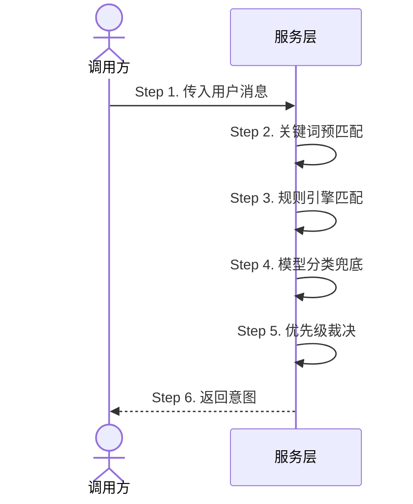

# 18.2 独立功能文档样例

> 本文给出一个完整的独立功能文档样例，展示从场景中抽取的复用功能如何独立成篇。
> 功能：意图识别与分发。属于服务层，被多个场景引用。

## 抽取理由

- **独立**：有自己的演进轨迹——从最初的关键词匹配，到规则引擎，再到模型分类，迭代了多次
- **复杂**：匹配规则、优先级、兜底策略、多轮上下文影响，值得单独说清楚
- **被多个场景复用**：对话意图识别与分发、行程规划入口、闲聊兜底等场景都调用它

## 目录位置

这个功能属于服务层，所以放在：

```
10-史实/@interact_ecology_agent_llm_server/服务层/意图识别/意图识别与分发.md
```

如果服务层下只有这一个功能，不需要建子目录，直接放：

```
10-史实/@interact_ecology_agent_llm_server/服务层/意图识别与分发.md
```

---

## 完整文档

> 以下展示一篇独立功能文档的完整内容。frontmatter 在 Obsidian 中不可见，其余内容直接渲染。

---

commits: [a1b2c3d, b2c3d4e, c3d4e5f]
repo: interact_ecology_agent_llm_server

# 意图识别与分发（样例）

生命周期：会话级 — 每次请求创建，请求完成即销毁



## 1. 输入

系统接收用户消息文本和可选的上下文（前几轮对话），准备判断用户意图。

输入内容包含：

- 用户消息文本（必填）
- 上下文对话记录（可选，最多 5 轮）
- 当前会话 ID（用于多轮场景去重）

> 输入结构定义 ↗ [repos/agent_llm/src/service/intent.go]

## 2. 关键词预匹配

系统先用关键词表做快速匹配，这是最快的一层。关键词表按意图分组，每组对应一个意图标签。

### 2.1 匹配规则

- 消息中包含某意图的关键词 → 标记为候选意图，置信度 0.6
- 同时匹配多个意图 → 全部标记为候选，进入优先级裁决（见 5）
- 无任何匹配 → 进入规则引擎匹配（见 3）

### 2.2 关键词表示例

| 意图 | 关键词 |
|------|--------|
| 行程规划 | 旅游、行程、攻略、几天、景点 |
| 路线规划 | 怎么走、路线、从...到...、导航 |
| 闲聊 | 你好、谢谢、讲个笑话 |

> 关键词表和匹配逻辑 ↗ [repos/agent_llm/src/service/keyword_matcher.go]

## 3. 规则引擎匹配

关键词没命中时，系统用规则引擎做更复杂的匹配。规则由条件组合而成，支持 AND/OR/NOT 逻辑。

### 3.1 规则示例

- 消息包含地点词 AND 行程相关词 → 行程规划意图，置信度 0.8
- 消息包含起点词 AND 终点词 → 路线规划意图，置信度 0.8
- 消息长度 < 5 AND 不包含任何动词 → 闲聊意图，置信度 0.5

### 3.2 规则优先级

规则引擎内部按优先级排序，高优先级规则先匹配。如果高优先级规则命中，低优先级规则不再执行。规则优先级在配置中定义，支持动态调整。

> 规则定义和执行引擎 ↗ [repos/agent_llm/src/service/rule_engine.go]

## 4. 模型分类兜底

关键词和规则都没命中时，系统调用意图分类模型做兜底。模型输入是用户消息 + 上下文，输出是意图标签 + 置信度。

### 4.1 置信度阈值

- 置信度 ≥ 0.7 → 采纳模型结果
- 置信度 < 0.7 → 标记为"闲聊"意图（最终兜底）

### 4.2 演进历史

→ [c3d4e5f] 2026-03-10 新增模型分类兜底
之前关键词和规则都没命中时直接标记为闲聊。新增模型分类后，闲聊是最后的兜底，不是唯一兜底。模型分类能处理关键词和规则覆盖不到的模糊表达，比如"帮我安排一下北京的事"虽然没有行程关键词，但模型能判断为行程规划。
← [c3d4e5f]

> 模型调用和置信度处理 ↗ [repos/agent_llm/src/service/intent_classifier.go]

## 5. 优先级裁决

当多个匹配结果同时存在时（比如关键词匹配到行程规划，规则引擎也匹配到行程规划），系统按来源优先级裁决：

| 优先级 | 来源 | 说明 |
|--------|------|------|
| 1 | 规则引擎 | 规则匹配最精确，优先级最高 |
| 2 | 模型分类 | 模型分类次之 |
| 3 | 关键词预匹配 | 关键词最粗糙，优先级最低 |

### 5.1 裁决规则

- 同一来源内，取置信度最高的候选
- 不同来源间，高优先级来源的结果胜出
- 如果高优先级来源有多个候选，取其中置信度最高的

### 5.2 特殊情况

如果所有来源都没命中（理论上不会发生，因为模型分类一定会返回结果），系统标记为"闲聊"意图作为最终兜底。

> 优先级裁决逻辑 ↗ [repos/agent_llm/src/service/intent.go]

## 6. 输出

系统返回意图标签、置信度、匹配来源。调用方根据意图标签分发到对应处理流程。

### 6.1 输出内容

- 意图标签：行程规划 / 路线规划 / 闲聊
- 置信度：0~1 的浮点数
- 匹配来源：关键词 / 规则引擎 / 模型分类
- 提取的实体：地点、时间、起点终点等（如果有）

### 6.2 被谁引用

- [[对话意图识别与分发]] — 控制器层，对话入口
- [[行程规划入口]] — 控制器层，行程规划专用入口
- [[闲聊兜底]] — 服务层，无意图匹配时的兜底

---

## 样例要点说明

| 规范点 | 样例中的体现 |
|--------|-------------|
| frontmatter | 多个 commit：`commits: [a1b2c3d, b2c3d4e, c3d4e5f]` |
| 生命周期标注 | `生命周期：会话级` |
| 时序图骨架 | 参与者标代码层级，消息标 `Step N`，只画骨架不展开细节 |
| Step 与标题对应 | 时序图 Step 1~6 对应 `## 1.`~`## 6.` |
| 技术骨架 + 产品语言 | 骨架标"服务层"，细节写"系统用关键词表做快速匹配"不写方法名 |
| 编号展开 | `## 2.` → `### 2.1` → `### 2.2` → `## 3.` → `### 3.1` → `### 3.2` |
| 外链回溯 | `↗ [repos/agent_llm/src/service/keyword_matcher.go]` |
| 迭代穿插 | 第 4.2 节用 `→ [c3d4e5f]` 标记新增的模型分类兜底 |
| 被谁引用 | 末尾 6.2 列出引用此文档的场景文档 |
| 放在对应层级 | 属于服务层，文件放 `服务层/` 下 |

## 与场景文档的区别

| 维度 | 场景文档 | 独立功能文档 |
|------|---------|-------------|
| 写什么 | 一个场景的全链路 | 一个功能自身的完整逻辑 |
| 入口 | 场景的入口（控制器、服务层等） | 功能自身的入口 |
| 放哪 | 入口所在的代码层级 | 功能所属的代码层级 |
| 被引用 | 不被引用，自己是引用方 | 被多个场景文档引用 |
| 末尾 | 不需要列"被谁引用" | 列出"被谁引用" |
